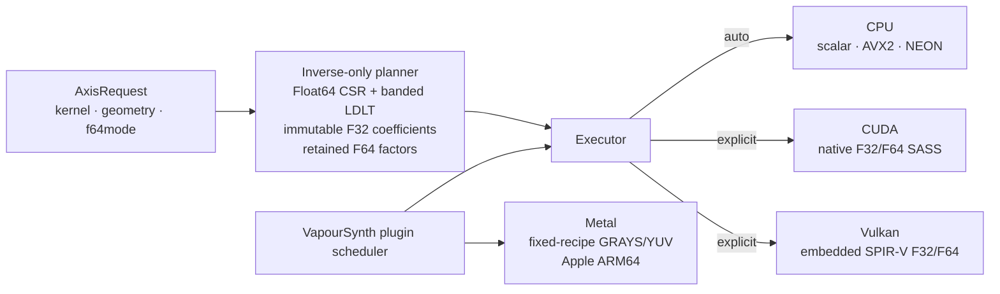

# dsmvc

[](https://github.com/MysteryDove/vapoursynth-descalemvc/actions/workflows/build.yml)
[](LICENSE)


`dsmvc` is a VapourSynth API4 plugin compatible with the public filter API of
Irrational-Encoding-Wizardry/descale, with native Metal, Vulkan, CUDA/CPU(AVX2/FMA, NEON).

For native-resolution discovery, we recommend [GetNative-VF](https://github.com/MysteryDove/GetNative-VF)
as the practical `getnative` alternative. It is designed for the same
candidate-search workflow and can use `dsmvc` as the descale implementation.

> **Use GetNative-VF for faster getnative:** on an RTX 5080, a complete candidate scan
> reaches approximately **3,600 candidates/s** with CUDA. That is about
> **65x the original descale plugin** and about **8x the current plugin's CPU
> candidate-scan throughput** on the same workload. These are measurements for
> the specified RTX 5080 and candidate graph.

## Hardware support at a glance

| Route | Supported hardware |
|---|---|
| CPU | x86-64 with a universal scalar path and optional AVX2/FMA acceleration; ARM64/AArch64 with scalar and NEON/FMA paths. Automatic routing selects the fastest path supported by the current CPU. |
| CUDA | NVIDIA Turing or newer (compute capability 7.5+) on Windows and Linux. Covering GeForce GTX 16/RTX 20, RTX 30, RTX 40, and RTX 50 series respectively. |
| Vulkan | Windows or Linux devices with a Vulkan 1.2 driver. Float64 additionally requires the capabilities listed in [Backend support](#backend-support). |
| Metal | Apple Silicon M-series systems on macOS 13.3 or newer. Retained-Float64 work uses the CPU fallback. |

CUDA devices without a matching native image (Like a Datacenter Nvidia GPU) can use the embedded compute_75
or compute_120 PTX through NVIDIA driver JIT when compatible.

> **Release performance and output error:**
> Measured CPU/ARM/Vulkan results are listed in the [full release
> benchmark](docs/release-benchmark.md) and [ARM benchmark](docs/arm-benchmark.md).

## Usage

The native VapourSynth plugin accepts constant-format GRAY, YUV, and RGB
clips. Integer and non-Float32 input is converted internally when needed. For
subsampled formats, the output dimensions must remain compatible with the
source chroma subsampling.

Native plugin API (`core.dsmvc`):

```text
core.dsmvc.Debilinear(clip src, int width, int height, float blur=1.0, float src_left=0.0, float src_top=0.0, float src_width=width, float src_height=height, int border_handling=None, int force=0, int force_h=force, int force_v=force, int opt=0, data backend="auto", int padding=3, int f64mode=0)

core.dsmvc.Debicubic(clip src, int width, int height, float b=0.0, float c=0.5, float blur=1.0, float src_left=0.0, float src_top=0.0, float src_width=width, float src_height=height, int border_handling=None, int force=0, int force_h=force, int force_v=force, int opt=0, data backend="auto", int padding=3, int f64mode=0)

core.dsmvc.Delanczos(clip src, int width, int height, int taps=3, float blur=1.0, float src_left=0.0, float src_top=0.0, float src_width=width, float src_height=height, int border_handling=None, int force=0, int force_h=force, int force_v=force, int opt=0, data backend="auto", int padding=3, int f64mode=0)

core.dsmvc.Despline16(clip src, int width, int height, float blur=1.0, float src_left=0.0, float src_top=0.0, float src_width=width, float src_height=height, int border_handling=None, int force=0, int force_h=force, int force_v=force, int opt=0, data backend="auto", int padding=3, int f64mode=0)

core.dsmvc.Despline36(...)

core.dsmvc.Despline64(...)

core.dsmvc.Descale(clip src, int width, int height, data kernel=None, int taps=3, float b=0.0, float c=0.5, float blur=1.0, float src_left=0.0, float src_top=0.0, float src_width=width, float src_height=height, int border_handling=None, int force=0, int force_h=force, int force_v=force, int opt=0, func custom=None, int support=None, func custom_kernel=None, data backend="auto", int padding=3, int f64mode=0)
```

`padding` and the legacy `border_handling` argument are mutually exclusive.
Generic `Descale` requires either `kernel` or a custom-kernel callback; custom
kernels also require `taps` or `support`.

### Basic example

```python
core.std.LoadPlugin(path=r"C:\path\to\dsmvc.dll")
output = core.dsmvc.Debicubic(source, 1280, 720, b=0.0, c=0.5)
# CUDA-enabled builds opt in explicitly:
gpu_output = core.dsmvc.Debicubic(
    source, 1280, 720, b=0.0, c=0.5, backend="cuda")
# Vulkan-enabled builds use the same explicit backend contract:
vulkan_output = core.dsmvc.Debicubic(
    source, 1280, 720, b=0.0, c=0.5, backend="vulkan")
```

The plugin identifier is `com.dsmvc.descale`. It intentionally exports the
API4 `VapourSynthPluginInit2` entry point only; API3 hosts are not supported.
It does not register a `core.descale` alias.

## Backend support

| Backend | Float32 | Float64 | Integer output | Routing |
|---|---|---|---|---|
| CPU scalar | ✅ | ✅ | reference | `auto` / explicit |
| CPU AVX2 (x86-64) | ✅ | ✅ | <= 1 code vs scalar | `auto` / explicit |
| CPU NEON (AArch64) | ✅ | ✅ | <= 1 code vs scalar | `auto` / explicit |
| CUDA | ✅ | ✅ | <= 1 code vs scalar | explicit only |
| Vulkan 1.2 | ✅ | ✅¹ | <= 1 code vs scalar | explicit only |
| Metal (Apple ARM64) | ✅ | routed to CPU² | <= 1 code vs scalar | mixed plugin-level |

¹ Vulkan Float64 requires a strict device capability contract:
`shaderFloat64`, RTE Float64 rounding, and NaN/Inf/signed-zero preservation.
Devices that do not meet it are rejected with an explicit error, never a
silent fallback. Denorm preservation is probed and recorded; devices without
it (including NVIDIA) run with a documented flush-to-zero boundary for
subnormal intermediates.

² The plugin-level Metal scheduler keeps its heterogeneous contract and
routes Float64 plans to its CPU fallback; the direct Metal executor rejects
Float64 plans explicitly.

Float64 float output matches the CPU scalar Float64 reference within 1 output
ULP on every backend. For both F32 and F64 solves, U8/U10/U16 output differs
from the same-precision CPU scalar reference by at most 1 code; pairwise
backend differences are not the contract. Repeated execution on one concrete
route is bit-exact, and CPU buffered/streamed plus fused/two-pass dynamic
routes are bit-exact with each other. Automatic routing never selects a
Float64 plan on a GPU backend -- that admission requires paired plugin-level
evidence against the optimized CPU Float64 path, which has not yet been
collected.

Retained-F64 entry points reject NaN or infinity in their input or result with
`std::runtime_error`; signed zero and finite subnormals remain valid. Public
matrix executors access only each row's logical width. A caller may allocate
exactly `(rows - 1) * stride + logical_width` elements, without full pitch
padding after the final row, and output padding is never modified.



## Arguments

The native functions preserve the baseline arguments, add JET v12-compatible
`blur:float`, then append the optional `backend:data`, `padding:int`, and
`f64mode:int` controls shown above.

`Descale` accepts the baseline custom-kernel forms `custom`/`support` and
`custom_kernel`/`taps`. If both aliases are supplied, baseline precedence is
preserved: `custom` wins over `custom_kernel`, and `taps` wins over `support`.

`blur` defaults to `1.0` and is available on every fixed-kernel entry, generic
`Descale`, and the Python wrappers. It stretches a kernel entirely during plan
construction:

```text
effective_support = ceil(base_support * blur)
weight = kernel(distance / blur)
```

The value must be finite and greater than zero, and the plugin requires it to
be smaller than the minimum input-plane extent. Lanczos continues to use its
original `taps` value for the window even when effective support grows. The
default `blur=1.0` plan follows the original coefficient path without an added
division. Wider supports increase planning, factor, and execution cost, and may
change the normal matrix enough for automatic `f64mode=0` to retain Float64.
There is no extra per-frame convolution, frame, or memory round trip.

`padding` selects the explicit edge extension and defaults to `3`:

| Value | Behavior |
|---|---|
| `0` | zero padding |
| `1` | repeat the nearest edge sample |
| `2` | periodic reflect101 (`... 2 1 \| 0 1 2 ...`), without duplicating the edge |
| `3` | periodic symmetric (`... 1 0 \| 0 1 2 ...`), with a duplicated edge |

The legacy `border_handling` argument remains available, but cannot be combined
with `padding`. Its `1` and `2` values retain zero and repeat behavior. Value `0`
(and other legacy values) selects the original descale mirror mapping: for a
half-pixel tap center `x`, negative `x` maps to `-x` and right-side `x` maps to
`min(2*N-x, N-0.5)`. This is an edge-duplicating symmetric reflection for the
first image-width only, not a periodic extension. Original descale commit
`8c53f5d` applies no second reflection or bounds guard for extreme custom
support; dsmvc safely discards a tap that remains out of range after the legacy
mapping.

`f64mode` controls solve precision: `0` (default) automatically retains and
uses Float64 factors when the normal matrix has estimated `rcond < 1e-4`, `1`
forces the Float32 path, and `2` forces the Float64 path. The condition estimate
is retained in all three modes. Explicit CUDA and Vulkan execute Float64 plans
natively or raise an error; they never fall back to CPU. The plugin-level Metal
scheduler routes a Float64 plan to its CPU fallback.

`backend` accepts `auto`, `cpu`, `metal`, `vulkan`, or `cuda`. A normal build
uses CPU for `auto`. Enabled builds accept `cuda` or `vulkan` on a compatible
device. The opt-in Apple ARM64 Metal build adds explicit fixed-recipe GRAYS and
YUV420P8/P10 routes. Its automatic route requires at least 64 frames, at least
8 core threads, a wide kernel, sufficient measured work, and concurrent or
resident-source admission on a unified-memory Apple M-series device. GRAY as
well as YUV formats may participate when their format and dimensions satisfy
those gates. Short clips, narrow kernels, low concurrency, and unsupported
geometry remain on CPU under `auto`. An unavailable or uncompiled explicit
backend raises an error. Explicit CUDA and Vulkan do not silently fall back;
explicit Metal is a mixed plugin-level route and publishes whether a frame
actually used Metal.

For the CPU backend, `opt=1` selects the scalar path and `opt=2` strictly
requires AVX2/FMA on x86-64 or NEON/FMA on AArch64. On x86-64, `opt=3`
strictly requires AVX-512F/DQ/BW/VL and FMA. The default selects AVX-512,
then AVX2 or NEON, when available. Other numeric values retain baseline
behavior and select automatic dispatch. The Python wrapper accepts either
these integers or `Opt.AUTO`, `Opt.NONE`, `Opt.AVX2`, `Opt.AVX512`, `Opt.NEON`,
and `Opt.SIMD`; `Opt.AVX2`, `Opt.NEON`, and `Opt.SIMD` preserve `opt=2`, while
`Opt.AVX512` is the new explicit value.

The current AVX-512 path specializes F32 vertical solves in 16-column blocks
and the profiled B7 horizontal solve in 16-row blocks. Other horizontal bands,
F64, integer, and fused 2D operations retain the AVX2 kernels until an isolated
benchmark demonstrates a worthwhile 512-bit implementation.

At the public engine level, explicitly requesting `CpuPath::avx2`,
`CpuPath::avx512`, or
`CpuPath::neon` also requires that exact path to be compiled and supported by
the current CPU; it raises an error otherwise. Only `CpuPath::automatic` may
fall back to scalar.

Planning is deferred until the first requested frame. The inverse-only planner
uses Float64 CSR and banded LDLT construction, stores immutable Float32
coefficients, and retains Float64 factors according to `f64mode`. Built-in plans
use bounded exact-key single-flight LRU caching; the exact blur bit pattern is
part of the plan key. Sampling geometry is cached separately by effective
support, so different blur values in the same support tier can reuse it. SIMD
packed plans are shared by filters that share a canonical Float32 plan.

The Python wrapper is [dsmvc.py](dsmvc.py). It preserves the
baseline RGB, YUV, GRAY, bit-depth, subsampling, `yuv444`, `gray`, and chroma
conversion behavior while dispatching to `core.dsmvc`.

## Performance snapshot

The following snapshot combines the latest RTX 5080 CUDA candidate scan with
the published CPU, ARM, and Vulkan release reports. Candidate/s figures are
end-to-end GetNative graph measurements unless noted otherwise; GPU backends
are explicitly selected.

| Platform / route | Candidate-scan result | Comparison |
|---|---|---|
| RTX 5080 / CUDA | **417.457 candidates/s** | **7.30x** original descale |
| Ryzen 9 5950X / CPU at R32T32 | **370.049 candidates/s** | **6.47x** original descale |
| Apple M4 Max / ARM NEON at R16T16 | **421.237 candidates/s** | **2.25x** original descale |
| RTX 5080 / Vulkan at R32T32 | **353.068 candidates/s** | **2.618x** the v0.1.0 Vulkan result; refreshed 2026-08-27 |

The CUDA/CPU/ARM/Vulkan measurements use different hosts and request levels;
compare ratios within each benchmark rather than absolute candidates/s across
machines. See the [CPU/CUDA/Vulkan report](docs/release-benchmark.md) and
[ARM report](docs/arm-benchmark.md) for fixed-kernel, BlankClip, accuracy, and
backend-contract results.

All GPU timings were serialized under a benchmark lock during the private
benchmark runs.

## Build

Requirements:

- CMake 3.24 or newer
- A C++23 compiler
- VapourSynth API4 headers
- On Windows, Visual Studio 2022 with the x64 C++ workload

Native Apple ARM64 Release and RelWithDebInfo builds use `-O3 -flto=full`
without an Apple-model-specific `-mcpu` setting. CMake selects the NEON source
only for AArch64 and the existing AVX2/FMA source only for x86-64; universal
macOS builds must be produced as separate architecture builds. Set
`DSMVC_ENABLE_NATIVE_CPU_SIMD=OFF` for a scalar-only portability or
contract-test build; normal builds leave it enabled.

The Metal backend is enabled by default only for native Apple ARM64 builds with
the Xcode Metal toolchain. Release packages set the backend and deployment
target explicitly; the supported macOS baseline is 13.3:

```sh
cmake -S . -B build-metal -G Ninja \
  -DCMAKE_BUILD_TYPE=RelWithDebInfo \
  -DCMAKE_OSX_ARCHITECTURES=arm64 \
  -DCMAKE_OSX_DEPLOYMENT_TARGET=13.3 \
  -DDSMVC_VAPOURSYNTH_SDK=/path/to/vapoursynth \
  -DDSMVC_ENABLE_METAL=ON \
  -DBUILD_TESTING=ON
cmake --build build-metal --parallel
ctest --test-dir build-metal --output-on-failure
```

Non-Apple builds do not compile or link the Metal executor. Pass
`-DDSMVC_ENABLE_METAL=OFF` to produce a CPU-only Apple ARM64 build. Supported
formats, geometry, device admission, batch sizes, and automatic routing remain
limited to validated cases.

The Release DLL is written to `build/Release/dsmvc.dll`. The build uses the
static MSVC runtime so that an older runtime DLL bundled with a host cannot
change the STL synchronization ABI.

### CUDA

The CUDA backend is optional and currently supports Windows and Linux with a
CUDA Toolkit containing the CUDA compiler and static Runtime library.
CUDA-enabled test builds also require `cuobjdump`:

```sh
cmake -S . -B build-cuda \
  -DDSMVC_VAPOURSYNTH_SDK=/path/to/vapoursynth \
  -DDSMVC_ENABLE_CUDA=ON
cmake --build build-cuda --config Release --parallel
```

The build embeds native SM75, SM86, SM89, and SM120 kernels by default, plus
compute_75 and compute_120 PTX fallbacks. The matrix is configurable with
`DSMVC_CUDA_ARCHITECTURES` and `DSMVC_CUDA_PTX_ARCHITECTURES`. Architectures
without a native image use driver JIT compilation and may incur a first-run
delay. The plugin statically links the official CUDA Runtime and therefore does
not require a CUDA Runtime DLL or shared library beside it. CUDA Runtime device
code, streams, and allocations use the device's primary context so they can
coexist with other CUDA filters in the host process.

| Variable | Default | Meaning |
|---|---|---|
| `DSMVC_CUDA_STREAMS` | adaptive | Explicit slot count `1`–`16`. Unset: up to 8 concurrent slots for reused-input 2D plans with half-bandwidth ≥ 7, narrower 2D and one-axis work limited to 4. An explicit value disables adaptive limits. |
| `DSMVC_CUDA_HOST_TRANSFER` | pinned staging pool | `staging` restores slot-local Float32 staging; `pageable`/`registered` select diagnostic direct-copy paths (both slower on the reference system). |
| `DSMVC_CUDA_INPUT_CACHE_MB` | `64` | Bounds the shared immutable-input cache; `0` disables source upload and first-transpose reuse. Keep enabled for repeated-source workloads (GetNative scans); disable for long unique-frame runs. |
| `DSMVC_CUDA_PLAN_CACHE_MB` | `16` | Bounds the device-resident packed-plan LRU. Deliberately small for use-once height scans; increase for long-lived many-plan workloads. |
| `DSMVC_CUDA_SPLIT_RHS` | adaptive | Half-bandwidth ≥ 3: first execution of a packed plan stays fused, later ones use the higher-throughput split RHS kernel. `0` disables, `force` splits from the first execution. |
| `DSMVC_CUDA_SPLIT_HORIZONTAL_THREADS` / `DSMVC_CUDA_SPLIT_VERTICAL_THREADS` | `32` | Power-of-two values `16`–`256`. |
| `DSMVC_CUDA_HORIZONTAL_GLOBAL_TRANSPOSE` | `1` | The row-major `0` mode is available for experiments but is not the tested default. |

Float32 2D frames use a separate bounded pinned-staging pool: unique inputs
admit two GPU executions and four host staging phases at once, while
input-cache hits can expand to the full slot count. This keeps host packing
and unpacking outside the lifetime of a GPU execution slot. Integer and
one-axis paths retain slot-local staging. Use an explicit low stream count
only when reducing peak device memory is more important than adaptive
mixed-workload throughput. For a GetNative graph containing tens of thousands
of candidate frames, also set a finite VapourSynth cache before constructing
the graph, for example `core.max_cache_size = 512`; VapourSynth's default can
otherwise retain several GiB of host frames independently of the CUDA cache
limits. CUDA uses hardware fused multiply-add, so Float32 output is
numerically checked against the scalar backend but is not promised to be
bit-identical.

### Vulkan

The Vulkan 1.2 backend is optional on Windows and Linux. A build requires the
Vulkan SDK headers, loader, and `glslc`; test builds also require `spirv-val`:

```sh
cmake -S . -B build-vulkan \
  -DDSMVC_VAPOURSYNTH_SDK=/path/to/vapoursynth \
  -DDSMVC_ENABLE_VULKAN=ON
cmake --build build-vulkan --config Release --parallel
```

GLSL is compiled with `--target-env=vulkan1.2 -O`, validated in test builds,
and embedded in the plugin. Installed packages need only the system Vulkan
loader and a Vulkan 1.2 driver; they do not load shader sidecars or a runtime
compiler. For Float32 work, devices need only a compute queue and the Vulkan
core compute limits — no FP16, subgroup, narrow storage, descriptor indexing,
or synchronization2 feature is required. Explicit Float64 additionally
requires the strict capability contract described in the support matrix, and
F32-only devices continue to build and run normally.

| Variable | Default | Meaning |
|---|---|---|
| `DSMVC_VULKAN_DEVICE` | scored selection | Vulkan enumeration index or hexadecimal `vendor_id:device_id`. Default scores discrete, integrated, virtual, and CPU devices in that order and prefers a compute-only queue. An invalid or ineligible explicit selection reports all detected devices and does not fall back. |
| `DSMVC_VULKAN_SLOTS` | adaptive | `1`–`16`; unset uses a four-slot default with eight-slot heavy-plan expansion. |
| `DSMVC_VULKAN_PLAN_CACHE_MB` / `DSMVC_VULKAN_INPUT_CACHE_MB` | `16` / `64` | Device plan LRU and immutable-input cache bounds. |
| `DSMVC_VULKAN_SPLIT_RHS` | adaptive | `0` / `adaptive` / `force` fused versus split RHS execution. |
| `DSMVC_VULKAN_VALIDATION` | off | `1` enables the Khronos validation layer when installed. |
| `DSMVC_VULKAN_WORKGROUP` | — | `128` forces the core-limit fallback variants for diagnostics. |

Float32 results use explicit shader `fma` and are numerically checked, not
promised to be bit-identical to CPU or CUDA.

## Benchmark

The reproducible old/new runner and its case definitions are documented in
[benchmarks/README.md](benchmarks/README.md). A full run uses the fixed input
and baseline hashes, executes each implementation in separate processes, and
writes JSON, CSV, Markdown, command lines, images, difference maps, and error
curves outside the VapourSynth installation.

The API3/API4 CPU regression runner and the opt-in Apple ARM64 Metal validation
workflow are documented in [benchmarks/README.md](benchmarks/README.md).
`benchmarks/validate_api4_apple_arm.sh` is the release gate for this migration;
it records architecture-specific build commands, correctness and identity
checks, paired CPU/Metal results, system-pressure snapshots, and required CI
evidence.

`benchmarks/blank_fixed_kernel_benchmark.py --blurs 0.75 1 1.01 1.25 1.5`
records blur, effective support, and half-bandwidth in JSON, CSV, and Markdown.
Non-unity values may compare only `jet` and `new`, because original IEW descale
does not expose blur. Use `--omit-unity-blur` to benchmark the omitted default
separately from an explicit `blur=1.0` call.

For the real-video end-to-end comparison based on the supplied training HTML,
`test_getfnative*.vpy`, and `test_selectkernel.vpy`, use
`benchmarks/e2e_benchmark.py`. It accepts the
explicit MKV, current plugin, original plugin, VapourSynth Python, and VSPipe
paths, and writes paired performance and error reports.

## License

dsmvc is MIT licensed. See [LICENSE](LICENSE) and
[THIRD_PARTY_NOTICES.md](THIRD_PARTY_NOTICES.md).
