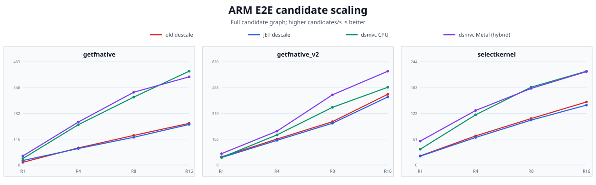
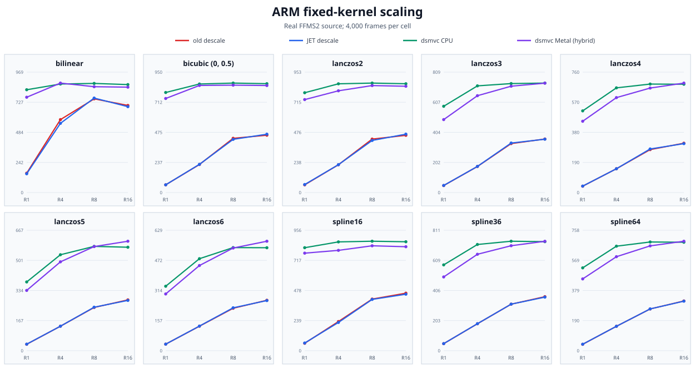
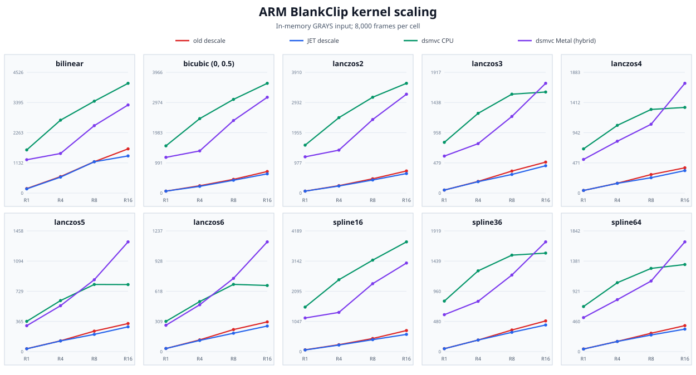

# Descale MVC Apple Silicon Release Benchmark

_Official ARM benchmark; collected 2026-08-24 on dsmvc source `99b920a`._

## Executive Summary

This is the Apple Silicon companion to `release-benchmark.md`. It uses the same source bytes and release source SHA, but absolute FPS and candidates/s must not be subtracted across machines. Cross-platform reading is limited to speedup, scaling shape, and numerical consistency.

| Workload | Result |
|---|---:|
| E2E getfnative at R16T16 | 421.237 candidates/s CPU; 396.038 explicit mixed Metal |
| getfnative CPU speedup | 2.25x vs old; 2.31x vs JET |
| Fixed kernel coverage | 10 kernels x 4 thread levels x 4 columns; 4,000 frames each |
| BlankClip kernel coverage | 10 kernels x 4 thread levels x 4 columns; 8,000 frames each |
| Error coverage | 34,101 candidates across three recipes and two scalar references |
| Accuracy showcase | 6 ill-conditioned plans; automatic F64 removes the 3.27e6 Lanczos2 F32 peak |

The `dsmvc-metal` column is explicit `backend="metal"`, but it is heterogeneous rather than a pure-GPU result: executor and plan work remains on CPU, and only scheduler-admitted axis batches run on Metal over UMA. Automatic routing on this source also requires both `numFrames >= 64` and `core_threads >= 8`; admitted frames remain mixed. The explicit Metal column demonstrates the hybrid path but is not a measurement of `backend="auto"` throughput, because automatic scheduling applies additional admission policy. R1 explicit Metal is entirely CPU fallback, while R4 explicit Metal admits some batches even though auto is ineligible below 8 core threads. This differs from the x86 report, where auto always routes CPU and explicit GPU columns are opt-in.

Both reference plugins are ARM64 source builds with `DESCALE_X86` undefined, so old IEW and JET use scalar C. The forced dsmvc CPU column uses the ARM NEON path.

## Test System and Run Configuration

| Item | Configuration |
|---|---|
| Chip | Apple M4 Max; 40 Core GPU |
| OS | macOS 27.0 (build 26A5416b), arm64 |
| Memory | 128 GiB unified memory |
| Power | AC attached; High Power mode (`powermode=2`); system sleep disabled on AC |
| VapourSynth | Core R78; API R4.2 / R3.6; Python 3.14.6 |
| Input | 1920x1080 HEVC-10bit MKV |
| Source filter | Explicit ARM64 FFMS2 for every decoded workload |
| Thread sweep | R1T1, R4T4, R8T8, R16T16 |
| Repetition | One fresh process and one measured run per cell, campaign-wide serial mkdir lock |
| dsmvc build | CMake Release, source `99b920a`; plugin SHA-256 `4742e33b...24db8` |
| Reference builds | IEW `8c53f5d` and JET `d699532b`; Meson release; scalar C on ARM |

CTest passed 10/10 before measurement. The three-way healthy-kernel gate passed 8/8; its largest max-absolute difference was below `1e-6` (threshold `1e-4`).

## E2E Case Definitions

| Case | Measured candidate space |
|---|---|
| `getfnative` | frame 12493; 11 scalers x 2,800 heights = 30,800 candidates |
| `getfnative_v2` | frame 358; 8 scalers x 400 heights = 3,200 candidates |
| `selectkernel` | frame 1111; bilinear + 10x10 Bicubic grid = 101 candidates |

The complete graph includes FFMS2 decode, plane extraction, Float32 conversion, descale, reconstruction, border crop, Expr, PlaneStats, frame delivery, and process overhead.

## E2E Thread Scaling

### `getfnative`

| Threads | old | JET | dsmvc-cpu | dsmvc-metal | cpu vs old | cpu vs JET |
|---|---:|---:|---:|---:|---:|---:|
| R1T1 | 12.336 | 20.279 | 29.082 | 40.681 | 2.36x | 1.43x |
| R4T4 | 76.823 | 74.008 | 181.193 | 193.036 | 2.36x | 2.45x |
| R8T8 | 132.990 | 124.579 | 304.894 | 326.762 | 2.29x | 2.45x |
| R16T16 | 187.193 | 182.202 | 421.237 | 396.038 | 2.25x | 2.31x |

### `getfnative_v2`

| Threads | old | JET | dsmvc-cpu | dsmvc-metal | cpu vs old | cpu vs JET |
|---|---:|---:|---:|---:|---:|---:|
| R1T1 | 49.301 | 45.045 | 45.564 | 68.386 | 0.92x | 1.01x |
| R4T4 | 156.060 | 148.304 | 181.016 | 203.499 | 1.16x | 1.22x |
| R8T8 | 260.372 | 251.167 | 346.600 | 421.744 | 1.33x | 1.38x |
| R16T16 | 425.375 | 409.174 | 467.331 | 563.805 | 1.10x | 1.14x |

### `selectkernel`

| Threads | old | JET | dsmvc-cpu | dsmvc-metal | cpu vs old | cpu vs JET |
|---|---:|---:|---:|---:|---:|---:|
| R1T1 | 21.665 | 20.921 | 37.368 | 56.653 | 1.72x | 1.79x |
| R4T4 | 68.985 | 65.238 | 118.939 | 129.220 | 1.72x | 1.82x |
| R8T8 | 109.978 | 106.358 | 184.325 | 181.301 | 1.68x | 1.73x |
| R16T16 | 149.292 | 141.919 | 222.139 | 221.225 | 1.49x | 1.57x |

## Metal Route Evidence

The frame property `_DSMVCMetalBatch` was sampled over each route probe. A nonzero batch marks Metal execution; zero marks CPU fallback.

| Cell | Probe frames | Metal frames | Max batch | Observed route |
|---|---:|---:|---:|---|
| R1T1 | 1024 | 0 | 0 | cpu |
| R4T4 | 1024 | 39 | 3 | mixed |
| R8T8 | 1024 | 73 | 3 | mixed |
| R16T16 | 1024 | 102 | 4 | mixed |

## E2E Error Comparison

The CPU error sweep evaluates every candidate against old and JET separately. All three recipes retain the same best candidate and best MAE across old, JET, and dsmvc within a `1e-8` comparison tolerance.

The `getfnative` maximum output difference of about `0.0553` is the expected automatic-F64 behavior inherited from the x86 report: near-unity ill-conditioned candidates keep the scalar references on F32 while dsmvc auto follows its F64 plan. The best candidate and reconstruction MAE remain consistent; this is not a ranking regression.

| Case | Reference | Candidates | Best reference | Best dsmvc | Changed | Max output abs | Max reconstruction abs |
|---|---|---:|---|---|---|---:|---:|
| `getfnative` | `old` | 30,800 | `bilinear@979.2` (0.00053924043) | `bilinear@979.2` (0.00053924043) | False | 0.0553046 | 8.28505e-06 |
| `getfnative_v2` | `old` | 3,200 | `bicubic_b1.0_c0.0@876.7` (0.00047605204) | `bicubic_b1.0_c0.0@876.7` (0.00047605205) | False | 1.37091e-06 | 2.38419e-07 |
| `selectkernel` | `old` | 101 | `bicubic_b0.0_c0.0@719.8` (0.0012279396) | `bicubic_b0.0_c0.0@719.8` (0.0012279337) | False | 2.38419e-06 | 8.34465e-07 |
| `getfnative` | `jet` | 30,800 | `bilinear@979.2` (0.00053924043) | `bilinear@979.2` (0.00053924043) | False | 0.0553046 | 8.28505e-06 |
| `getfnative_v2` | `jet` | 3,200 | `bicubic_b1.0_c0.0@876.7` (0.00047605204) | `bicubic_b1.0_c0.0@876.7` (0.00047605205) | False | 1.37091e-06 | 2.38419e-07 |
| `selectkernel` | `jet` | 101 | `bicubic_b0.0_c0.0@719.8` (0.0012279396) | `bicubic_b0.0_c0.0@719.8` (0.0012279337) | False | 2.38419e-06 | 8.34465e-07 |

## Fixed-Kernel Throughput

The decoded-source run holds each kernel and 1440x810 geometry fixed for 4,000 frames.

### R1T1

| Kernel | old | JET | dsmvc-cpu | dsmvc-metal | cpu vs old | cpu vs JET |
|---|---:|---:|---:|---:|---:|---:|
| `bilinear` | 155.948 | 150.953 | 827.101 | 766.851 | 5.30x | 5.48x |
| `bicubic (0, 0.5)` | 60.929 | 61.021 | 789.359 | 742.023 | 12.96x | 12.94x |
| `lanczos2` | 60.889 | 63.503 | 789.927 | 735.677 | 12.97x | 12.44x |
| `lanczos3` | 46.862 | 47.706 | 579.459 | 490.030 | 12.37x | 12.15x |
| `lanczos4` | 40.101 | 40.750 | 515.748 | 450.262 | 12.86x | 12.66x |
| `lanczos5` | 35.614 | 36.221 | 381.019 | 334.081 | 10.70x | 10.52x |
| `lanczos6` | 34.126 | 34.176 | 336.655 | 296.343 | 9.87x | 9.85x |
| `spline16` | 58.870 | 60.937 | 818.133 | 774.786 | 13.90x | 13.43x |
| `spline36` | 47.402 | 47.628 | 578.240 | 496.926 | 12.20x | 12.14x |
| `spline64` | 40.155 | 40.817 | 521.612 | 452.042 | 12.99x | 12.78x |

### R4T4

| Kernel | old | JET | dsmvc-cpu | dsmvc-metal | cpu vs old | cpu vs JET |
|---|---:|---:|---:|---:|---:|---:|
| `bilinear` | 586.777 | 556.779 | 873.114 | 880.640 | 1.49x | 1.57x |
| `bicubic (0, 0.5)` | 221.026 | 222.541 | 856.250 | 844.760 | 3.87x | 3.85x |
| `lanczos2` | 220.091 | 220.578 | 860.568 | 805.222 | 3.91x | 3.90x |
| `lanczos3` | 175.018 | 175.576 | 716.517 | 650.493 | 4.09x | 4.08x |
| `lanczos4` | 150.410 | 150.309 | 661.126 | 599.521 | 4.40x | 4.40x |
| `lanczos5` | 135.687 | 135.793 | 531.873 | 492.482 | 3.92x | 3.92x |
| `lanczos6` | 127.900 | 128.582 | 480.575 | 444.815 | 3.76x | 3.74x |
| `spline16` | 231.585 | 224.427 | 864.172 | 796.910 | 3.73x | 3.85x |
| `spline36` | 181.438 | 181.865 | 715.707 | 649.704 | 3.94x | 3.94x |
| `spline64` | 153.623 | 153.680 | 658.106 | 591.916 | 4.28x | 4.28x |

### R8T8

| Kernel | old | JET | dsmvc-cpu | dsmvc-metal | cpu vs old | cpu vs JET |
|---|---:|---:|---:|---:|---:|---:|
| `bilinear` | 753.720 | 760.090 | 877.912 | 851.542 | 1.16x | 1.16x |
| `bicubic (0, 0.5)` | 427.956 | 419.594 | 863.554 | 847.353 | 2.02x | 2.06x |
| `lanczos2` | 423.075 | 412.294 | 866.280 | 846.643 | 2.05x | 2.10x |
| `lanczos3` | 328.718 | 332.502 | 731.926 | 714.285 | 2.23x | 2.20x |
| `lanczos4` | 271.143 | 275.258 | 684.994 | 659.846 | 2.53x | 2.49x |
| `lanczos5` | 239.607 | 241.126 | 578.138 | 577.210 | 2.41x | 2.40x |
| `lanczos6` | 221.607 | 224.055 | 538.598 | 536.316 | 2.43x | 2.40x |
| `spline16` | 409.987 | 407.246 | 869.436 | 833.236 | 2.12x | 2.13x |
| `spline36` | 313.405 | 313.659 | 737.607 | 707.394 | 2.35x | 2.35x |
| `spline64` | 262.722 | 263.138 | 684.517 | 660.051 | 2.61x | 2.60x |

### R16T16

| Kernel | old | JET | dsmvc-cpu | dsmvc-metal | cpu vs old | cpu vs JET |
|---|---:|---:|---:|---:|---:|---:|
| `bilinear` | 700.808 | 690.967 | 868.556 | 847.852 | 1.24x | 1.26x |
| `bicubic (0, 0.5)` | 452.386 | 460.419 | 858.763 | 844.296 | 1.90x | 1.87x |
| `lanczos2` | 452.972 | 462.164 | 861.026 | 841.232 | 1.90x | 1.86x |
| `lanczos3` | 359.592 | 358.227 | 735.216 | 734.652 | 2.04x | 2.05x |
| `lanczos4` | 311.751 | 308.869 | 683.958 | 691.214 | 2.19x | 2.21x |
| `lanczos5` | 281.693 | 278.758 | 573.505 | 606.720 | 2.04x | 2.06x |
| `lanczos6` | 263.561 | 261.881 | 537.801 | 571.785 | 2.04x | 2.05x |
| `spline16` | 456.903 | 448.725 | 865.259 | 825.795 | 1.89x | 1.93x |
| `spline36` | 364.158 | 360.844 | 734.767 | 737.202 | 2.02x | 2.04x |
| `spline64` | 313.185 | 311.849 | 682.978 | 689.295 | 2.18x | 2.19x |

## BlankClip Kernel Throughput

BlankClip removes decoder cost and isolates the kernel, scheduler, and any CPU/Metal transfer work over 8,000 frames.

### R1T1

| Kernel | old | JET | dsmvc-cpu | dsmvc-metal | cpu vs old | cpu vs JET |
|---|---:|---:|---:|---:|---:|---:|
| `bilinear` | 168.301 | 156.898 | 1617.560 | 1249.665 | 9.61x | 10.31x |
| `bicubic (0, 0.5)` | 64.090 | 63.520 | 1550.814 | 1173.071 | 24.20x | 24.41x |
| `lanczos2` | 63.540 | 62.671 | 1551.737 | 1173.587 | 24.42x | 24.76x |
| `lanczos3` | 47.694 | 47.621 | 805.194 | 587.066 | 16.88x | 16.91x |
| `lanczos4` | 40.616 | 40.688 | 689.134 | 524.632 | 16.97x | 16.94x |
| `lanczos5` | 35.363 | 34.371 | 365.637 | 313.102 | 10.34x | 10.64x |
| `lanczos6` | 31.991 | 31.989 | 309.939 | 270.309 | 9.69x | 9.69x |
| `spline16` | 63.310 | 58.255 | 1545.610 | 1167.514 | 24.41x | 26.53x |
| `spline36` | 47.543 | 46.120 | 803.280 | 587.238 | 16.90x | 17.42x |
| `spline64` | 40.444 | 39.423 | 688.005 | 519.126 | 17.01x | 17.45x |

### R4T4

| Kernel | old | JET | dsmvc-cpu | dsmvc-metal | cpu vs old | cpu vs JET |
|---|---:|---:|---:|---:|---:|---:|
| `bilinear` | 617.031 | 597.585 | 2733.525 | 1484.332 | 4.43x | 4.57x |
| `bicubic (0, 0.5)` | 240.750 | 220.516 | 2444.960 | 1384.727 | 10.16x | 11.09x |
| `lanczos2` | 240.205 | 228.270 | 2442.171 | 1390.109 | 10.17x | 10.70x |
| `lanczos3` | 184.891 | 180.489 | 1265.877 | 784.739 | 6.85x | 7.01x |
| `lanczos4` | 153.418 | 151.590 | 1056.147 | 808.196 | 6.88x | 6.97x |
| `lanczos5` | 130.858 | 129.099 | 616.488 | 554.675 | 4.71x | 4.78x |
| `lanczos6` | 120.415 | 114.707 | 513.062 | 480.177 | 4.26x | 4.47x |
| `spline16` | 240.893 | 228.295 | 2495.171 | 1361.451 | 10.36x | 10.93x |
| `spline36` | 184.281 | 183.839 | 1284.076 | 799.527 | 6.97x | 6.98x |
| `spline64` | 156.172 | 154.963 | 1051.587 | 792.711 | 6.73x | 6.79x |

### R8T8

| Kernel | old | JET | dsmvc-cpu | dsmvc-metal | cpu vs old | cpu vs JET |
|---|---:|---:|---:|---:|---:|---:|
| `bilinear` | 1176.539 | 1173.393 | 3444.515 | 2528.216 | 2.93x | 2.94x |
| `bicubic (0, 0.5)` | 450.127 | 421.310 | 3077.147 | 2382.620 | 6.84x | 7.30x |
| `lanczos2` | 462.586 | 423.407 | 3103.117 | 2381.193 | 6.71x | 7.33x |
| `lanczos3` | 349.262 | 295.803 | 1570.257 | 1216.472 | 4.50x | 5.31x |
| `lanczos4` | 288.748 | 239.569 | 1304.421 | 1073.291 | 4.52x | 5.44x |
| `lanczos5` | 247.664 | 208.624 | 811.336 | 868.305 | 3.28x | 3.89x |
| `lanczos6` | 226.132 | 188.695 | 688.989 | 750.470 | 3.05x | 3.65x |
| `spline16` | 455.055 | 415.344 | 3174.953 | 2357.768 | 6.98x | 7.64x |
| `spline36` | 343.707 | 306.942 | 1533.629 | 1217.747 | 4.46x | 5.00x |
| `spline64` | 280.456 | 254.065 | 1269.860 | 1076.843 | 4.53x | 5.00x |

### R16T16

| Kernel | old | JET | dsmvc-cpu | dsmvc-metal | cpu vs old | cpu vs JET |
|---|---:|---:|---:|---:|---:|---:|
| `bilinear` | 1656.897 | 1392.353 | 4114.933 | 3303.621 | 2.48x | 2.96x |
| `bicubic (0, 0.5)` | 708.183 | 631.567 | 3605.200 | 3146.870 | 5.09x | 5.71x |
| `lanczos2` | 715.663 | 632.337 | 3554.364 | 3201.477 | 4.97x | 5.62x |
| `lanczos3` | 491.295 | 434.039 | 1604.233 | 1742.705 | 3.27x | 3.70x |
| `lanczos4` | 394.071 | 350.511 | 1336.100 | 1712.048 | 3.39x | 3.81x |
| `lanczos5` | 339.515 | 299.653 | 810.033 | 1325.702 | 2.39x | 2.70x |
| `lanczos6` | 304.507 | 262.292 | 677.751 | 1124.444 | 2.23x | 2.58x |
| `spline16` | 732.235 | 598.548 | 3808.364 | 3074.442 | 5.20x | 6.36x |
| `spline36` | 488.282 | 423.490 | 1566.179 | 1744.615 | 3.21x | 3.70x |
| `spline64` | 396.802 | 343.604 | 1328.877 | 1674.338 | 3.35x | 3.87x |

## Ill-Conditioned Plan Accuracy Showcase

Frame 12493 is compared with dsmvc forced-F64 CPU output. The first five cases exercise automatic promotion; Spline64 is the near-unity control that remains F32.

| Case | Metric | old | JET | dsmvc F32 | dsmvc auto | auto routed F64 |
|---|---|---:|---:|---:|---:|---|
| `lanczos2-catastrophic` | mae | 535.742 | 535.742 | 535.74 | 0 | True |
| `lanczos2-catastrophic` | max_abs | 3.27265e+06 | 3.27265e+06 | 3.27264e+06 | 0 | True |
| `lanczos2-fractional` | mae | 1.16636e-06 | 1.16636e-06 | 1.16894e-06 | 0 | True |
| `lanczos2-fractional` | max_abs | 0.00294495 | 0.00294495 | 0.00293744 | 0 | True |
| `bicubic-c060-fractional` | mae | 4.86525e-07 | 4.86525e-07 | 4.8886e-07 | 0 | True |
| `bicubic-c060-fractional` | max_abs | 0.00111622 | 0.00111622 | 0.00111151 | 0 | True |
| `bicubic-c075-fractional` | mae | 2.98261e-07 | 2.98261e-07 | 3.00399e-07 | 0 | True |
| `bicubic-c075-fractional` | max_abs | 0.000570655 | 0.000570655 | 0.000565886 | 0 | True |
| `bicubic-c100-fractional` | mae | 1.55511e-07 | 1.55511e-07 | 1.5755e-07 | 0 | True |
| `bicubic-c100-fractional` | max_abs | 0.000267923 | 0.000267923 | 0.00026685 | 0 | True |
| `spline64-near-unity-control` | mae | 9.78185e-08 | 9.78185e-08 | 1.04083e-07 | 1.04083e-07 | False |
| `spline64-near-unity-control` | max_abs | 9.75728e-05 | 9.75728e-05 | 9.94802e-05 | 9.94802e-05 | False |

## Interpretation and Reproducibility

- Compare columns only within this M4 Max campaign. Against x86, compare ratios, scaling shape, route semantics, and error consistency rather than absolute throughput.
- `dsmvc-metal` is a mixed explicit-backend measurement, not a claim that every axis kernel ran on the GPU or that the values equal `backend="auto"` throughput. Route-probe counts above define only the observed explicit-backend boundary.
- One run per cell captures the requested official protocol but does not estimate run-to-run variance; small differences should not be over-interpreted.
- No autoload descale plugin existed, so quarantine and restoration were not required.
