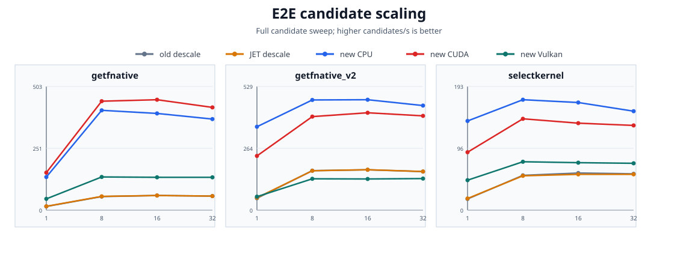
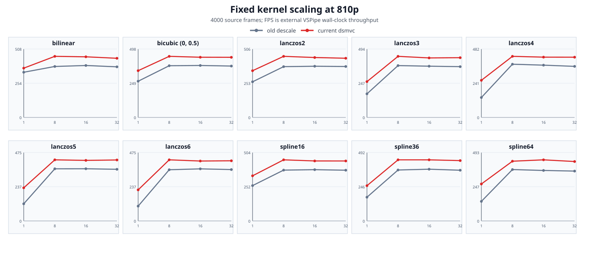
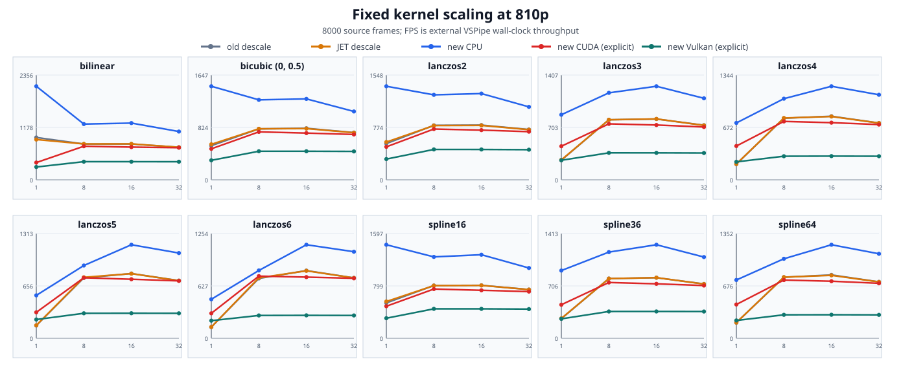

# Descale MVC Release Benchmark

_Official release benchmark; CPU/CUDA/reference data collected 2026-08-23 on
dsmvc source `99b920a`; optimized Vulkan data refreshed 2026-08-26, with the
final E2E Vulkan R1T1-R32T32 sweeps collected 2026-08-27 from the v0.1.1 release
candidate._

## Executive Summary

This package compares the current Release build against the original descale plugin (IEW, Descale-11) and the maintained JET fork (v12) on the same Digimon source, VapourSynth runtime, decoder, geometry, and thread configurations, plus explicit CUDA and Vulkan backend columns for the current plugin.

| Workload | Result |
|---|---:|
| E2E getfnative candidates | 370.049 candidates/s (CPU) / 417.457 (CUDA) / 353.068 (Vulkan) at R32T32 |
| getfnative speedup vs old | 8.90x at R1T1, 6.47x at R32T32 (CPU column) |
| getfnative speedup vs JET | 8.59x at R1T1, 6.47x at R32T32 (CPU column) |
| Fixed kernel coverage | 10 kernels x 4 thread levels x 5 columns, 4,000 frames each |
| BlankClip kernel coverage | 10 kernels x 4 thread levels x 5 columns, 8,000 frames each |
| Error coverage | 34,101 candidates across three recipes, old and JET references |
| Accuracy showcase | 6 ill-conditioned plans; old/JET float32 error up to 3.3e6 absolute on `lanczos2-catastrophic`, dsmvc auto matches the F64 reference bit-exactly |

GPU columns measure the current plugin with an explicitly forced backend (`backend=cuda` / `backend=vulkan`). Automatic mode always routes to CPU, so the CPU column is the out-of-box experience; GPU columns are opt-in.

## Test System and Run Configuration

| Item | Configuration |
|---|---|
| CPU | `AMD Ryzen 9 5950X 16-Core Processor (16C/32T)` |
| OS | `Linux-7.0.0-30-generic-x86_64-with-glibc2.43` |
| Memory | `32 GiB` DDR4@3600Mhz |
| VapourSynth | `Core R78; API R4.2; API R3.6` |
| Input | 1920x1080; 1080p HEVC-10bit MKV |
| Source filter | `lsmas` |
| Descale geometry | base `1778x1000`, native target `1440x810` |
| Thread sweep | `R1T1`, `R8T8`, `R16T16`, `R32T32`; each cell uses `core.num_threads=N` and `--requests N` |
| Performance repetition | One fresh VSPipe process per implementation/case/thread cell under a campaign-wide flock; Vulkan refreshes added one warmup and an idle-utilization gate; each final E2E Vulkan case/thread cell used three valid full-scan samples |
| BlankClip throughput | In-memory `std.BlankClip`, 1920x1080 GRAYS, fixed 810p geometry, 8,000 frames per cell |

## E2E Case Definitions

The measured graph starts with `source -> ShufflePlanes(plane=0, GRAY) -> resize.Point(format=GRAYS)`. For each candidate it calls the reference namespace (`core.descale` — IEW or JET build) or the current namespace (`core.dsmvc`) through `Debilinear`, `Debicubic`, `Delanczos`, `Despline16`, or `Despline36`, reconstructs with the matching `core.resize.*` kernel, then applies `std.Expr`, a 5-pixel border crop, and `PlaneStats`.

| Case | Scenario | Reference call shape | Measured candidate space |
|---|---|---|---|
| `getfnative` | Full non-vertical GetNative candidate scan | `muf.getnative(src, rescaler, src_heights=arange(700, 980, 0.1), base_height=1000)` | frame 12493; 11 scalers x 2,800 heights = 30,800 candidates |
| `getfnative_v2` | Vertical-only GetNative candidate scan | `muf.getnative(src, rescaler, src_heights=arange(840, 880, 0.1), base_height=1000, vertical_only=True)` | frame 358; 8 scalers x 400 heights = 3,200 candidates |
| `selectkernel` | Kernel-parameter selection at a fixed height | `muf.getnative(src, src_heights=719.8, base_height=1000, ex_thr=0.012, rescalers=...)` | frame 1111; bilinear + 10x10 Bicubic b/c grid = 101 candidates |

## Build and Provenance

- Historical CPU/CUDA/reference source: master `99b920a` (2026-08-23); build
  `Release`, CUDA + Vulkan enabled, GCC 15.2.0, CUDA 13.3, Vulkan SDK 1.4.357
- Optimized Vulkan build: v0.1.1 release-candidate source snapshot; plugin
  SHA-256 `486a96f07d8e4ce8171231719c3f7166c4facce0fa429d584f51fd0ff890fd98`
- Correctness gates: historical campaign ctest 23/23 and
  `dsmvc_cpu_f64_avx2_benchmark --check-only` 76/76 bit-exact (0 ULP);
  v0.1.1 release candidate ctest 35/35 plus full VapourSynth CUDA/Vulkan
  integration on the RTX 5080 host
- old descale: IEW Descale-11 (`tegaf.asi.xe`), the vsrepo binary
- JET descale: v12 built from source, pinned commit `d699532b` (2026-08-20), meson release; IEW and JET share the plugin identifier and namespace, so every reference cell runs in its own VSPipe process with the vsrepo copy quarantined for the campaign duration
- Binary hashes and gate outputs were checked during the private benchmark run.

On healthy 1080p -> 810p geometries all three implementations agree with the F64 reference to float32 rounding (max ~8e-7).

### Vulkan performance refresh

The v0.1.1 refresh replaced every Vulkan performance cell while preserving the
source bytes, graphs, geometry, frame counts, and thread/request sweep. Each
group used one warmup and an idle-utilization gate. All E2E Vulkan points are
three-sample medians; fixed-kernel and BlankClip Vulkan cells retain the one-run
table protocol. CPU, CUDA, reference-plugin, error-sweep, and accuracy data
remain from the 2026-08-23 campaign.

## E2E Thread Scaling

The chart reports candidates per second for the complete candidate graph. It includes planner/cache work, FrameEval, reconstruction, Expr, PlaneStats, frame delivery, and VSPipe process overhead. GPU columns are explicit-backend runs (`backend=cuda` / `backend=vulkan`); automatic mode always routes to CPU, so the CPU column is what an unconfigured user gets. Every Vulkan point in all three E2E recipes is a final three-sample median.

### `getfnative`

| Threads | old descale | JET descale | dsmvc-cpu | dsmvc-cuda | dsmvc-vulkan | cpu vs old | cpu vs JET |
|---|---:|---:|---:|---:|---:|---:|---:|
| R1T1 | 15.129 | 15.676 | 134.662 | 152.479 | 124.007 | 8.90x | 8.59x |
| R8T8 | 55.259 | 55.963 | 405.593 | 442.680 | 357.684 | 7.34x | 7.25x |
| R16T16 | 59.513 | 59.534 | 392.952 | 448.681 | 354.461 | 6.60x | 6.60x |
| R32T32 | 57.174 | 57.173 | 370.049 | 417.457 | 353.068 | 6.47x | 6.47x |

### `getfnative_v2`

| Threads | old descale | JET descale | dsmvc-cpu | dsmvc-cuda | dsmvc-vulkan | cpu vs old | cpu vs JET |
|---|---:|---:|---:|---:|---:|---:|---:|
| R1T1 | 50.895 | 52.987 | 356.503 | 231.825 | 208.887 | 7.00x | 6.73x |
| R8T8 | 168.882 | 168.378 | 470.976 | 399.807 | 400.949 | 2.79x | 2.80x |
| R16T16 | 172.568 | 172.796 | 471.971 | 416.223 | 408.160 | 2.73x | 2.73x |
| R32T32 | 164.893 | 165.103 | 446.947 | 402.958 | 396.830 | 2.71x | 2.71x |

### `selectkernel`

| Threads | old descale | JET descale | dsmvc-cpu | dsmvc-cuda | dsmvc-vulkan | cpu vs old | cpu vs JET |
|---|---:|---:|---:|---:|---:|---:|---:|
| R1T1 | 17.489 | 18.188 | 139.034 | 90.335 | 75.381 | 7.95x | 7.64x |
| R8T8 | 54.259 | 53.552 | 172.168 | 142.429 | 121.161 | 3.17x | 3.21x |
| R16T16 | 57.879 | 55.805 | 167.799 | 135.610 | 116.326 | 2.90x | 3.01x |
| R32T32 | 56.629 | 55.867 | 154.270 | 132.096 | 115.747 | 2.72x | 2.76x |

## E2E Error Comparison

The error sweep evaluates every candidate in each recipe on the same training frame, once per reference plugin (old and JET share the descale namespace, so each reference runs in its own worker process). Metrics compare reference and dsmvc-cpu reconstructed output against the source after the benchmark's 5-pixel border crop.

Reading the numbers: best candidates and best MAE are identical across old, JET, and dsmvc in all three recipes. `Max output abs` on `getfnative` is 0.0553 — this is not a regression but the automatic F64 fallback working: 11 candidates, all in the near-unity height family (972.1-979.9, the ill-conditioned geometry class), produce descaled output that differs between the reference plugins and dsmvc auto at pixel level. Direct re-measurement of the worst candidate (`bilinear@974.3`) shows old-vs-dsmvc-forced-F32 max abs 7.6e-5 (identical F32 behaviour), old-vs-dsmvc-forced-F64 0.0553, and old-vs-auto 0.0553 — i.e. the auto output follows the F64 reference, while the references stay on their F32 result. Both sides score identical source MAE (0.00055747) because the reconstruction error surface is flat there; dsmvc picks the F64-accurate point on it. The 2026-08 build predates this routing and matched old to 2.4e-07.

One jet-sweep row (`lanczos3@903.9`) shows a reconstruction max abs of 0.452 with bit-identical descaled output; direct re-evaluation of that exact candidate reproduces 0.0, so it is a measurement artifact of the long shard worker, not a numerical difference.

| Case | Reference | Candidates | Best reference | Best dsmvc | Changed | Max output abs | Max reconstruction abs |
|---|---|---:|---|---|---|---:|---:|
| `getfnative` | `old` | 30,800 | bilinear@979.2@979.2 (0.00053924) | bilinear@979.2@979.2 (0.00053924) | False | 0.0553046 | 8.34465e-06 |
| `getfnative` | `jet` | 30,800 | bilinear@979.2@979.2 (0.00053924) | bilinear@979.2@979.2 (0.00053924) | False | 0.0553046 | 0.452207 |
| `getfnative_v2` | `old` | 3,200 | bicubic_b1.0_c0.0@876.7@876.7 (0.000476052) | bicubic_b1.0_c0.0@876.7@876.7 (0.000476052) | False | 0 | 0 |
| `getfnative_v2` | `jet` | 3,200 | bicubic_b1.0_c0.0@876.7@876.7 (0.000476052) | bicubic_b1.0_c0.0@876.7@876.7 (0.000476052) | False | 0 | 0 |
| `selectkernel` | `old` | 101 | bicubic_b0.0_c0.0@719.8@719.8 (0.00122793) | bicubic_b0.0_c0.0@719.8@719.8 (0.00122793) | False | 0 | 0 |
| `selectkernel` | `jet` | 101 | bicubic_b0.0_c0.0@719.8@719.8 (0.00122793) | bicubic_b0.0_c0.0@719.8@719.8 (0.00122793) | False | 0 | 0 |

### Consolidated per-algorithm minima

Each row groups all parameter variants of one algorithm family and keeps the best reference/dsmvc candidate within that family. `Delta MAE` is `dsmvc - reference`; a negative MAE is an improvement.

| Case | Reference | Algorithm family | Candidates | Reference best (candidate; height / MAE) | dsmvc best (candidate; height / MAE) | Delta MAE | Delta height | Candidate changed |
|---|---|---|---:|---|---|---:|---:|---|
| `getfnative` | `old` | `bicubic_b0.0_c0.5` | 2,800 | `bicubic_b0.0_c0.5@979.3`; 979.3 / 0.000544565 | `bicubic_b0.0_c0.5@979.3`; 979.3 / 0.000544565 | -1.12e-12 | +0.0 | False |
| `getfnative` | `old` | `bicubic_b0.0_c0.8` | 2,800 | `bicubic_b0.0_c0.8@979.2`; 979.2 / 0.000560147 | `bicubic_b0.0_c0.8@979.2`; 979.2 / 0.000560147 | -1.03e-12 | +0.0 | False |
| `getfnative` | `old` | `bicubic_b0.0_c1.0` | 2,800 | `bicubic_b0.0_c1.0@979.2`; 979.2 / 0.000575825 | `bicubic_b0.0_c1.0@979.2`; 979.2 / 0.000575825 | -1.86e-13 | +0.0 | False |
| `getfnative` | `old` | `bicubic_b0.3_c0.3` | 2,800 | `bicubic_b0.3_c0.3@979.3`; 979.3 / 0.000552352 | `bicubic_b0.3_c0.3@979.3`; 979.3 / 0.000552352 | +4.74e-14 | +0.0 | False |
| `getfnative` | `old` | `bicubic_b1.0_c0.0` | 2,800 | `bicubic_b1.0_c0.0@979.2`; 979.2 / 0.000592964 | `bicubic_b1.0_c0.0@979.2`; 979.2 / 0.000592964 | -2.44e-13 | +0.0 | False |
| `getfnative` | `old` | `bilinear` | 2,800 | `bilinear@979.2`; 979.2 / 0.00053924 | `bilinear@979.2`; 979.2 / 0.00053924 | +8.82e-13 | +0.0 | False |
| `getfnative` | `old` | `lanczos2` | 2,800 | `lanczos2@979.2`; 979.2 / 0.00054352 | `lanczos2@979.2`; 979.2 / 0.00054352 | -2.33e-13 | +0.0 | False |
| `getfnative` | `old` | `lanczos3` | 2,800 | `lanczos3@979.2`; 979.2 / 0.000584545 | `lanczos3@979.2`; 979.2 / 0.000584545 | +2.04e-13 | +0.0 | False |
| `getfnative` | `old` | `lanczos4` | 2,800 | `lanczos4@979.3`; 979.3 / 0.000617304 | `lanczos4@979.3`; 979.3 / 0.000617304 | -8.2e-13 | +0.0 | False |
| `getfnative` | `old` | `spline16` | 2,800 | `spline16@979.2`; 979.2 / 0.000559219 | `spline16@979.2`; 979.2 / 0.000559219 | -6.96e-13 | +0.0 | False |
| `getfnative` | `old` | `spline36` | 2,800 | `spline36@979.2`; 979.2 / 0.000579655 | `spline36@979.2`; 979.2 / 0.000579655 | +2.7e-13 | +0.0 | False |
| `getfnative` | `jet` | `bicubic_b0.0_c0.5` | 2,800 | `bicubic_b0.0_c0.5@979.3`; 979.3 / 0.000544565 | `bicubic_b0.0_c0.5@979.3`; 979.3 / 0.000544565 | -1.12e-12 | +0.0 | False |
| `getfnative` | `jet` | `bicubic_b0.0_c0.8` | 2,800 | `bicubic_b0.0_c0.8@979.2`; 979.2 / 0.000560147 | `bicubic_b0.0_c0.8@979.2`; 979.2 / 0.000560147 | -1.03e-12 | +0.0 | False |
| `getfnative` | `jet` | `bicubic_b0.0_c1.0` | 2,800 | `bicubic_b0.0_c1.0@979.2`; 979.2 / 0.000575825 | `bicubic_b0.0_c1.0@979.2`; 979.2 / 0.000575825 | -1.86e-13 | +0.0 | False |
| `getfnative` | `jet` | `bicubic_b0.3_c0.3` | 2,800 | `bicubic_b0.3_c0.3@979.3`; 979.3 / 0.000552352 | `bicubic_b0.3_c0.3@979.3`; 979.3 / 0.000552352 | +4.74e-14 | +0.0 | False |
| `getfnative` | `jet` | `bicubic_b1.0_c0.0` | 2,800 | `bicubic_b1.0_c0.0@979.2`; 979.2 / 0.000592964 | `bicubic_b1.0_c0.0@979.2`; 979.2 / 0.000592964 | -2.44e-13 | +0.0 | False |
| `getfnative` | `jet` | `bilinear` | 2,800 | `bilinear@979.2`; 979.2 / 0.00053924 | `bilinear@979.2`; 979.2 / 0.00053924 | +8.82e-13 | +0.0 | False |
| `getfnative` | `jet` | `lanczos2` | 2,800 | `lanczos2@979.2`; 979.2 / 0.00054352 | `lanczos2@979.2`; 979.2 / 0.00054352 | -2.33e-13 | +0.0 | False |
| `getfnative` | `jet` | `lanczos3` | 2,800 | `lanczos3@979.2`; 979.2 / 0.000584545 | `lanczos3@979.2`; 979.2 / 0.000584545 | +2.04e-13 | +0.0 | False |
| `getfnative` | `jet` | `lanczos4` | 2,800 | `lanczos4@979.3`; 979.3 / 0.000617304 | `lanczos4@979.3`; 979.3 / 0.000617304 | -8.2e-13 | +0.0 | False |
| `getfnative` | `jet` | `spline16` | 2,800 | `spline16@979.2`; 979.2 / 0.000559219 | `spline16@979.2`; 979.2 / 0.000559219 | -6.96e-13 | +0.0 | False |
| `getfnative` | `jet` | `spline36` | 2,800 | `spline36@979.2`; 979.2 / 0.000579655 | `spline36@979.2`; 979.2 / 0.000579655 | +2.7e-13 | +0.0 | False |
| `getfnative_v2` | `old` | `bicubic_b0.0_c0.5` | 400 | `bicubic_b0.0_c0.5@877.5`; 877.5 / 0.000479465 | `bicubic_b0.0_c0.5@877.5`; 877.5 / 0.000479465 | +0 | +0.0 | False |
| `getfnative_v2` | `old` | `bicubic_b0.0_c0.8` | 400 | `bicubic_b0.0_c0.8@877.1`; 877.1 / 0.000482521 | `bicubic_b0.0_c0.8@877.1`; 877.1 / 0.000482521 | +0 | +0.0 | False |
| `getfnative_v2` | `old` | `bicubic_b0.0_c1.0` | 400 | `bicubic_b0.0_c1.0@876.2`; 876.2 / 0.000486479 | `bicubic_b0.0_c1.0@876.2`; 876.2 / 0.000486479 | +0 | +0.0 | False |
| `getfnative_v2` | `old` | `bicubic_b0.3_c0.3` | 400 | `bicubic_b0.3_c0.3@877.4`; 877.4 / 0.000477798 | `bicubic_b0.3_c0.3@877.4`; 877.4 / 0.000477798 | +0 | +0.0 | False |
| `getfnative_v2` | `old` | `bicubic_b1.0_c0.0` | 400 | `bicubic_b1.0_c0.0@876.7`; 876.7 / 0.000476052 | `bicubic_b1.0_c0.0@876.7`; 876.7 / 0.000476052 | +0 | +0.0 | False |
| `getfnative_v2` | `old` | `bilinear` | 400 | `bilinear@877.5`; 877.5 / 0.000483636 | `bilinear@877.5`; 877.5 / 0.000483636 | +0 | +0.0 | False |
| `getfnative_v2` | `old` | `spline16` | 400 | `spline16@877.4`; 877.4 / 0.000477543 | `spline16@877.4`; 877.4 / 0.000477543 | +0 | +0.0 | False |
| `getfnative_v2` | `old` | `spline36` | 400 | `spline36@876.8`; 876.8 / 0.000476866 | `spline36@876.8`; 876.8 / 0.000476866 | +0 | +0.0 | False |
| `getfnative_v2` | `jet` | `bicubic_b0.0_c0.5` | 400 | `bicubic_b0.0_c0.5@877.5`; 877.5 / 0.000479465 | `bicubic_b0.0_c0.5@877.5`; 877.5 / 0.000479465 | +0 | +0.0 | False |
| `getfnative_v2` | `jet` | `bicubic_b0.0_c0.8` | 400 | `bicubic_b0.0_c0.8@877.1`; 877.1 / 0.000482521 | `bicubic_b0.0_c0.8@877.1`; 877.1 / 0.000482521 | +0 | +0.0 | False |
| `getfnative_v2` | `jet` | `bicubic_b0.0_c1.0` | 400 | `bicubic_b0.0_c1.0@876.2`; 876.2 / 0.000486479 | `bicubic_b0.0_c1.0@876.2`; 876.2 / 0.000486479 | +0 | +0.0 | False |
| `getfnative_v2` | `jet` | `bicubic_b0.3_c0.3` | 400 | `bicubic_b0.3_c0.3@877.4`; 877.4 / 0.000477798 | `bicubic_b0.3_c0.3@877.4`; 877.4 / 0.000477798 | +0 | +0.0 | False |
| `getfnative_v2` | `jet` | `bicubic_b1.0_c0.0` | 400 | `bicubic_b1.0_c0.0@876.7`; 876.7 / 0.000476052 | `bicubic_b1.0_c0.0@876.7`; 876.7 / 0.000476052 | +0 | +0.0 | False |
| `getfnative_v2` | `jet` | `bilinear` | 400 | `bilinear@877.5`; 877.5 / 0.000483636 | `bilinear@877.5`; 877.5 / 0.000483636 | +0 | +0.0 | False |
| `getfnative_v2` | `jet` | `spline16` | 400 | `spline16@877.4`; 877.4 / 0.000477543 | `spline16@877.4`; 877.4 / 0.000477543 | +0 | +0.0 | False |
| `getfnative_v2` | `jet` | `spline36` | 400 | `spline36@876.8`; 876.8 / 0.000476866 | `spline36@876.8`; 876.8 / 0.000476866 | +0 | +0.0 | False |
| `selectkernel` | `old` | `bicubic_b0.0_c0.0` | 1 | `bicubic_b0.0_c0.0@719.8`; 719.8 / 0.00122793 | `bicubic_b0.0_c0.0@719.8`; 719.8 / 0.00122793 | +0 | +0.0 | False |
| `selectkernel` | `old` | `bicubic_b0.0_c0.1` | 1 | `bicubic_b0.0_c0.1@719.8`; 719.8 / 0.00122984 | `bicubic_b0.0_c0.1@719.8`; 719.8 / 0.00122984 | +0 | +0.0 | False |
| `selectkernel` | `old` | `bicubic_b0.0_c0.2` | 1 | `bicubic_b0.0_c0.2@719.8`; 719.8 / 0.00123295 | `bicubic_b0.0_c0.2@719.8`; 719.8 / 0.00123295 | +0 | +0.0 | False |
| `selectkernel` | `old` | `bicubic_b0.0_c0.3` | 1 | `bicubic_b0.0_c0.3@719.8`; 719.8 / 0.00123535 | `bicubic_b0.0_c0.3@719.8`; 719.8 / 0.00123535 | +0 | +0.0 | False |
| `selectkernel` | `old` | `bicubic_b0.0_c0.4` | 1 | `bicubic_b0.0_c0.4@719.8`; 719.8 / 0.00123875 | `bicubic_b0.0_c0.4@719.8`; 719.8 / 0.00123875 | +0 | +0.0 | False |
| `selectkernel` | `old` | `bicubic_b0.0_c0.5` | 1 | `bicubic_b0.0_c0.5@719.8`; 719.8 / 0.00124513 | `bicubic_b0.0_c0.5@719.8`; 719.8 / 0.00124513 | +0 | +0.0 | False |
| `selectkernel` | `old` | `bicubic_b0.0_c0.6` | 1 | `bicubic_b0.0_c0.6@719.8`; 719.8 / 0.00125423 | `bicubic_b0.0_c0.6@719.8`; 719.8 / 0.00125423 | +0 | +0.0 | False |
| `selectkernel` | `old` | `bicubic_b0.0_c0.7` | 1 | `bicubic_b0.0_c0.7@719.8`; 719.8 / 0.0012686 | `bicubic_b0.0_c0.7@719.8`; 719.8 / 0.0012686 | +0 | +0.0 | False |
| `selectkernel` | `old` | `bicubic_b0.0_c0.8` | 1 | `bicubic_b0.0_c0.8@719.8`; 719.8 / 0.00128756 | `bicubic_b0.0_c0.8@719.8`; 719.8 / 0.00128756 | +0 | +0.0 | False |
| `selectkernel` | `old` | `bicubic_b0.0_c0.9` | 1 | `bicubic_b0.0_c0.9@719.8`; 719.8 / 0.00130876 | `bicubic_b0.0_c0.9@719.8`; 719.8 / 0.00130876 | +0 | +0.0 | False |
| `selectkernel` | `old` | `bicubic_b0.1_c0.0` | 1 | `bicubic_b0.1_c0.0@719.8`; 719.8 / 0.0012285 | `bicubic_b0.1_c0.0@719.8`; 719.8 / 0.0012285 | +0 | +0.0 | False |
| `selectkernel` | `old` | `bicubic_b0.1_c0.1` | 1 | `bicubic_b0.1_c0.1@719.8`; 719.8 / 0.00123202 | `bicubic_b0.1_c0.1@719.8`; 719.8 / 0.00123202 | +0 | +0.0 | False |
| `selectkernel` | `old` | `bicubic_b0.1_c0.2` | 1 | `bicubic_b0.1_c0.2@719.8`; 719.8 / 0.00123451 | `bicubic_b0.1_c0.2@719.8`; 719.8 / 0.00123451 | +0 | +0.0 | False |
| `selectkernel` | `old` | `bicubic_b0.1_c0.3` | 1 | `bicubic_b0.1_c0.3@719.8`; 719.8 / 0.00123782 | `bicubic_b0.1_c0.3@719.8`; 719.8 / 0.00123782 | +0 | +0.0 | False |
| `selectkernel` | `old` | `bicubic_b0.1_c0.4` | 1 | `bicubic_b0.1_c0.4@719.8`; 719.8 / 0.00124348 | `bicubic_b0.1_c0.4@719.8`; 719.8 / 0.00124348 | +0 | +0.0 | False |
| `selectkernel` | `old` | `bicubic_b0.1_c0.5` | 1 | `bicubic_b0.1_c0.5@719.8`; 719.8 / 0.00125151 | `bicubic_b0.1_c0.5@719.8`; 719.8 / 0.00125151 | +0 | +0.0 | False |
| `selectkernel` | `old` | `bicubic_b0.1_c0.6` | 1 | `bicubic_b0.1_c0.6@719.8`; 719.8 / 0.00126519 | `bicubic_b0.1_c0.6@719.8`; 719.8 / 0.00126519 | +0 | +0.0 | False |
| `selectkernel` | `old` | `bicubic_b0.1_c0.7` | 1 | `bicubic_b0.1_c0.7@719.8`; 719.8 / 0.00128347 | `bicubic_b0.1_c0.7@719.8`; 719.8 / 0.00128347 | +0 | +0.0 | False |
| `selectkernel` | `old` | `bicubic_b0.1_c0.8` | 1 | `bicubic_b0.1_c0.8@719.8`; 719.8 / 0.00130487 | `bicubic_b0.1_c0.8@719.8`; 719.8 / 0.00130487 | +0 | +0.0 | False |
| `selectkernel` | `old` | `bicubic_b0.1_c0.9` | 1 | `bicubic_b0.1_c0.9@719.8`; 719.8 / 0.00132794 | `bicubic_b0.1_c0.9@719.8`; 719.8 / 0.00132794 | +0 | +0.0 | False |
| `selectkernel` | `old` | `bicubic_b0.2_c0.0` | 1 | `bicubic_b0.2_c0.0@719.8`; 719.8 / 0.00123017 | `bicubic_b0.2_c0.0@719.8`; 719.8 / 0.00123017 | +0 | +0.0 | False |
| `selectkernel` | `old` | `bicubic_b0.2_c0.1` | 1 | `bicubic_b0.2_c0.1@719.8`; 719.8 / 0.00123383 | `bicubic_b0.2_c0.1@719.8`; 719.8 / 0.00123383 | +0 | +0.0 | False |
| `selectkernel` | `old` | `bicubic_b0.2_c0.2` | 1 | `bicubic_b0.2_c0.2@719.8`; 719.8 / 0.00123721 | `bicubic_b0.2_c0.2@719.8`; 719.8 / 0.00123721 | +0 | +0.0 | False |
| `selectkernel` | `old` | `bicubic_b0.2_c0.3` | 1 | `bicubic_b0.2_c0.3@719.8`; 719.8 / 0.0012418 | `bicubic_b0.2_c0.3@719.8`; 719.8 / 0.0012418 | +0 | +0.0 | False |
| `selectkernel` | `old` | `bicubic_b0.2_c0.4` | 1 | `bicubic_b0.2_c0.4@719.8`; 719.8 / 0.0012495 | `bicubic_b0.2_c0.4@719.8`; 719.8 / 0.0012495 | +0 | +0.0 | False |
| `selectkernel` | `old` | `bicubic_b0.2_c0.5` | 1 | `bicubic_b0.2_c0.5@719.8`; 719.8 / 0.00126159 | `bicubic_b0.2_c0.5@719.8`; 719.8 / 0.00126159 | +0 | +0.0 | False |
| `selectkernel` | `old` | `bicubic_b0.2_c0.6` | 1 | `bicubic_b0.2_c0.6@719.8`; 719.8 / 0.0012799 | `bicubic_b0.2_c0.6@719.8`; 719.8 / 0.0012799 | +0 | +0.0 | False |
| `selectkernel` | `old` | `bicubic_b0.2_c0.7` | 1 | `bicubic_b0.2_c0.7@719.8`; 719.8 / 0.00130148 | `bicubic_b0.2_c0.7@719.8`; 719.8 / 0.00130148 | +0 | +0.0 | False |
| `selectkernel` | `old` | `bicubic_b0.2_c0.8` | 1 | `bicubic_b0.2_c0.8@719.8`; 719.8 / 0.00132464 | `bicubic_b0.2_c0.8@719.8`; 719.8 / 0.00132464 | +0 | +0.0 | False |
| `selectkernel` | `old` | `bicubic_b0.2_c0.9` | 1 | `bicubic_b0.2_c0.9@719.8`; 719.8 / 0.0013512 | `bicubic_b0.2_c0.9@719.8`; 719.8 / 0.0013512 | +0 | +0.0 | False |
| `selectkernel` | `old` | `bicubic_b0.3_c0.0` | 1 | `bicubic_b0.3_c0.0@719.8`; 719.8 / 0.00123299 | `bicubic_b0.3_c0.0@719.8`; 719.8 / 0.00123299 | +0 | +0.0 | False |
| `selectkernel` | `old` | `bicubic_b0.3_c0.1` | 1 | `bicubic_b0.3_c0.1@719.8`; 719.8 / 0.00123668 | `bicubic_b0.3_c0.1@719.8`; 719.8 / 0.00123668 | +0 | +0.0 | False |
| `selectkernel` | `old` | `bicubic_b0.3_c0.2` | 1 | `bicubic_b0.3_c0.2@719.8`; 719.8 / 0.00124059 | `bicubic_b0.3_c0.2@719.8`; 719.8 / 0.00124059 | +0 | +0.0 | False |
| `selectkernel` | `old` | `bicubic_b0.3_c0.3` | 1 | `bicubic_b0.3_c0.3@719.8`; 719.8 / 0.00124807 | `bicubic_b0.3_c0.3@719.8`; 719.8 / 0.00124807 | +0 | +0.0 | False |
| `selectkernel` | `old` | `bicubic_b0.3_c0.4` | 1 | `bicubic_b0.3_c0.4@719.8`; 719.8 / 0.00125919 | `bicubic_b0.3_c0.4@719.8`; 719.8 / 0.00125919 | +0 | +0.0 | False |
| `selectkernel` | `old` | `bicubic_b0.3_c0.5` | 1 | `bicubic_b0.3_c0.5@719.8`; 719.8 / 0.00127621 | `bicubic_b0.3_c0.5@719.8`; 719.8 / 0.00127621 | +0 | +0.0 | False |
| `selectkernel` | `old` | `bicubic_b0.3_c0.6` | 1 | `bicubic_b0.3_c0.6@719.8`; 719.8 / 0.00129881 | `bicubic_b0.3_c0.6@719.8`; 719.8 / 0.00129881 | +0 | +0.0 | False |
| `selectkernel` | `old` | `bicubic_b0.3_c0.7` | 1 | `bicubic_b0.3_c0.7@719.8`; 719.8 / 0.00132173 | `bicubic_b0.3_c0.7@719.8`; 719.8 / 0.00132173 | +0 | +0.0 | False |
| `selectkernel` | `old` | `bicubic_b0.3_c0.8` | 1 | `bicubic_b0.3_c0.8@719.8`; 719.8 / 0.00134827 | `bicubic_b0.3_c0.8@719.8`; 719.8 / 0.00134827 | +0 | +0.0 | False |
| `selectkernel` | `old` | `bicubic_b0.3_c0.9` | 1 | `bicubic_b0.3_c0.9@719.8`; 719.8 / 0.00137751 | `bicubic_b0.3_c0.9@719.8`; 719.8 / 0.00137751 | +0 | +0.0 | False |
| `selectkernel` | `old` | `bicubic_b0.4_c0.0` | 1 | `bicubic_b0.4_c0.0@719.8`; 719.8 / 0.00123573 | `bicubic_b0.4_c0.0@719.8`; 719.8 / 0.00123573 | +0 | +0.0 | False |
| `selectkernel` | `old` | `bicubic_b0.4_c0.1` | 1 | `bicubic_b0.4_c0.1@719.8`; 719.8 / 0.00124016 | `bicubic_b0.4_c0.1@719.8`; 719.8 / 0.00124016 | +0 | +0.0 | False |
| `selectkernel` | `old` | `bicubic_b0.4_c0.2` | 1 | `bicubic_b0.4_c0.2@719.8`; 719.8 / 0.00124708 | `bicubic_b0.4_c0.2@719.8`; 719.8 / 0.00124708 | +0 | +0.0 | False |
| `selectkernel` | `old` | `bicubic_b0.4_c0.3` | 1 | `bicubic_b0.4_c0.3@719.8`; 719.8 / 0.00125685 | `bicubic_b0.4_c0.3@719.8`; 719.8 / 0.00125685 | +0 | +0.0 | False |
| `selectkernel` | `old` | `bicubic_b0.4_c0.4` | 1 | `bicubic_b0.4_c0.4@719.8`; 719.8 / 0.00127345 | `bicubic_b0.4_c0.4@719.8`; 719.8 / 0.00127345 | +0 | +0.0 | False |
| `selectkernel` | `old` | `bicubic_b0.4_c0.5` | 1 | `bicubic_b0.4_c0.5@719.8`; 719.8 / 0.00129567 | `bicubic_b0.4_c0.5@719.8`; 719.8 / 0.00129567 | +0 | +0.0 | False |
| `selectkernel` | `old` | `bicubic_b0.4_c0.6` | 1 | `bicubic_b0.4_c0.6@719.8`; 719.8 / 0.00132007 | `bicubic_b0.4_c0.6@719.8`; 719.8 / 0.00132007 | +0 | +0.0 | False |
| `selectkernel` | `old` | `bicubic_b0.4_c0.7` | 1 | `bicubic_b0.4_c0.7@719.8`; 719.8 / 0.00134704 | `bicubic_b0.4_c0.7@719.8`; 719.8 / 0.00134704 | +0 | +0.0 | False |
| `selectkernel` | `old` | `bicubic_b0.4_c0.8` | 1 | `bicubic_b0.4_c0.8@719.8`; 719.8 / 0.00137682 | `bicubic_b0.4_c0.8@719.8`; 719.8 / 0.00137682 | +0 | +0.0 | False |
| `selectkernel` | `old` | `bicubic_b0.4_c0.9` | 1 | `bicubic_b0.4_c0.9@719.8`; 719.8 / 0.00140807 | `bicubic_b0.4_c0.9@719.8`; 719.8 / 0.00140807 | +0 | +0.0 | False |
| `selectkernel` | `old` | `bicubic_b0.5_c0.0` | 1 | `bicubic_b0.5_c0.0@719.8`; 719.8 / 0.00123937 | `bicubic_b0.5_c0.0@719.8`; 719.8 / 0.00123937 | +0 | +0.0 | False |
| `selectkernel` | `old` | `bicubic_b0.5_c0.1` | 1 | `bicubic_b0.5_c0.1@719.8`; 719.8 / 0.00124567 | `bicubic_b0.5_c0.1@719.8`; 719.8 / 0.00124567 | +0 | +0.0 | False |
| `selectkernel` | `old` | `bicubic_b0.5_c0.2` | 1 | `bicubic_b0.5_c0.2@719.8`; 719.8 / 0.00125575 | `bicubic_b0.5_c0.2@719.8`; 719.8 / 0.00125575 | +0 | +0.0 | False |
| `selectkernel` | `old` | `bicubic_b0.5_c0.3` | 1 | `bicubic_b0.5_c0.3@719.8`; 719.8 / 0.00127123 | `bicubic_b0.5_c0.3@719.8`; 719.8 / 0.00127123 | +0 | +0.0 | False |
| `selectkernel` | `old` | `bicubic_b0.5_c0.4` | 1 | `bicubic_b0.5_c0.4@719.8`; 719.8 / 0.00129267 | `bicubic_b0.5_c0.4@719.8`; 719.8 / 0.00129267 | +0 | +0.0 | False |
| `selectkernel` | `old` | `bicubic_b0.5_c0.5` | 1 | `bicubic_b0.5_c0.5@719.8`; 719.8 / 0.00131863 | `bicubic_b0.5_c0.5@719.8`; 719.8 / 0.00131863 | +0 | +0.0 | False |
| `selectkernel` | `old` | `bicubic_b0.5_c0.6` | 1 | `bicubic_b0.5_c0.6@719.8`; 719.8 / 0.00134621 | `bicubic_b0.5_c0.6@719.8`; 719.8 / 0.00134621 | +0 | +0.0 | False |
| `selectkernel` | `old` | `bicubic_b0.5_c0.7` | 1 | `bicubic_b0.5_c0.7@719.8`; 719.8 / 0.00137714 | `bicubic_b0.5_c0.7@719.8`; 719.8 / 0.00137714 | +0 | +0.0 | False |
| `selectkernel` | `old` | `bicubic_b0.5_c0.8` | 1 | `bicubic_b0.5_c0.8@719.8`; 719.8 / 0.00140936 | `bicubic_b0.5_c0.8@719.8`; 719.8 / 0.00140936 | +0 | +0.0 | False |
| `selectkernel` | `old` | `bicubic_b0.5_c0.9` | 1 | `bicubic_b0.5_c0.9@719.8`; 719.8 / 0.00144384 | `bicubic_b0.5_c0.9@719.8`; 719.8 / 0.00144384 | +0 | +0.0 | False |
| `selectkernel` | `old` | `bicubic_b0.6_c0.0` | 1 | `bicubic_b0.6_c0.0@719.8`; 719.8 / 0.00124515 | `bicubic_b0.6_c0.0@719.8`; 719.8 / 0.00124515 | +0 | +0.0 | False |
| `selectkernel` | `old` | `bicubic_b0.6_c0.1` | 1 | `bicubic_b0.6_c0.1@719.8`; 719.8 / 0.00125447 | `bicubic_b0.6_c0.1@719.8`; 719.8 / 0.00125447 | +0 | +0.0 | False |
| `selectkernel` | `old` | `bicubic_b0.6_c0.2` | 1 | `bicubic_b0.6_c0.2@719.8`; 719.8 / 0.00126934 | `bicubic_b0.6_c0.2@719.8`; 719.8 / 0.00126934 | +0 | +0.0 | False |
| `selectkernel` | `old` | `bicubic_b0.6_c0.3` | 1 | `bicubic_b0.6_c0.3@719.8`; 719.8 / 0.00129045 | `bicubic_b0.6_c0.3@719.8`; 719.8 / 0.00129045 | +0 | +0.0 | False |
| `selectkernel` | `old` | `bicubic_b0.6_c0.4` | 1 | `bicubic_b0.6_c0.4@719.8`; 719.8 / 0.00131753 | `bicubic_b0.6_c0.4@719.8`; 719.8 / 0.00131753 | +0 | +0.0 | False |
| `selectkernel` | `old` | `bicubic_b0.6_c0.5` | 1 | `bicubic_b0.6_c0.5@719.8`; 719.8 / 0.00134692 | `bicubic_b0.6_c0.5@719.8`; 719.8 / 0.00134692 | +0 | +0.0 | False |
| `selectkernel` | `old` | `bicubic_b0.6_c0.6` | 1 | `bicubic_b0.6_c0.6@719.8`; 719.8 / 0.00137854 | `bicubic_b0.6_c0.6@719.8`; 719.8 / 0.00137854 | +0 | +0.0 | False |
| `selectkernel` | `old` | `bicubic_b0.6_c0.7` | 1 | `bicubic_b0.6_c0.7@719.8`; 719.8 / 0.00141232 | `bicubic_b0.6_c0.7@719.8`; 719.8 / 0.00141232 | +0 | +0.0 | False |
| `selectkernel` | `old` | `bicubic_b0.6_c0.8` | 1 | `bicubic_b0.6_c0.8@719.8`; 719.8 / 0.00144838 | `bicubic_b0.6_c0.8@719.8`; 719.8 / 0.00144838 | +0 | +0.0 | False |
| `selectkernel` | `old` | `bicubic_b0.6_c0.9` | 1 | `bicubic_b0.6_c0.9@719.8`; 719.8 / 0.00148494 | `bicubic_b0.6_c0.9@719.8`; 719.8 / 0.00148494 | +0 | +0.0 | False |
| `selectkernel` | `old` | `bicubic_b0.7_c0.0` | 1 | `bicubic_b0.7_c0.0@719.8`; 719.8 / 0.00125449 | `bicubic_b0.7_c0.0@719.8`; 719.8 / 0.00125449 | +0 | +0.0 | False |
| `selectkernel` | `old` | `bicubic_b0.7_c0.1` | 1 | `bicubic_b0.7_c0.1@719.8`; 719.8 / 0.00126933 | `bicubic_b0.7_c0.1@719.8`; 719.8 / 0.00126933 | +0 | +0.0 | False |
| `selectkernel` | `old` | `bicubic_b0.7_c0.2` | 1 | `bicubic_b0.7_c0.2@719.8`; 719.8 / 0.00129049 | `bicubic_b0.7_c0.2@719.8`; 719.8 / 0.00129049 | +0 | +0.0 | False |
| `selectkernel` | `old` | `bicubic_b0.7_c0.3` | 1 | `bicubic_b0.7_c0.3@719.8`; 719.8 / 0.00131679 | `bicubic_b0.7_c0.3@719.8`; 719.8 / 0.00131679 | +0 | +0.0 | False |
| `selectkernel` | `old` | `bicubic_b0.7_c0.4` | 1 | `bicubic_b0.7_c0.4@719.8`; 719.8 / 0.00134807 | `bicubic_b0.7_c0.4@719.8`; 719.8 / 0.00134807 | +0 | +0.0 | False |
| `selectkernel` | `old` | `bicubic_b0.7_c0.5` | 1 | `bicubic_b0.7_c0.5@719.8`; 719.8 / 0.00138169 | `bicubic_b0.7_c0.5@719.8`; 719.8 / 0.00138169 | +0 | +0.0 | False |
| `selectkernel` | `old` | `bicubic_b0.7_c0.6` | 1 | `bicubic_b0.7_c0.6@719.8`; 719.8 / 0.0014176 | `bicubic_b0.7_c0.6@719.8`; 719.8 / 0.0014176 | +0 | +0.0 | False |
| `selectkernel` | `old` | `bicubic_b0.7_c0.7` | 1 | `bicubic_b0.7_c0.7@719.8`; 719.8 / 0.00145551 | `bicubic_b0.7_c0.7@719.8`; 719.8 / 0.00145551 | +0 | +0.0 | False |
| `selectkernel` | `old` | `bicubic_b0.7_c0.8` | 1 | `bicubic_b0.7_c0.8@719.8`; 719.8 / 0.00149358 | `bicubic_b0.7_c0.8@719.8`; 719.8 / 0.00149358 | +0 | +0.0 | False |
| `selectkernel` | `old` | `bicubic_b0.7_c0.9` | 1 | `bicubic_b0.7_c0.9@719.8`; 719.8 / 0.00153045 | `bicubic_b0.7_c0.9@719.8`; 719.8 / 0.00153045 | +0 | +0.0 | False |
| `selectkernel` | `old` | `bicubic_b0.8_c0.0` | 1 | `bicubic_b0.8_c0.0@719.8`; 719.8 / 0.00126945 | `bicubic_b0.8_c0.0@719.8`; 719.8 / 0.00126945 | +0 | +0.0 | False |
| `selectkernel` | `old` | `bicubic_b0.8_c0.1` | 1 | `bicubic_b0.8_c0.1@719.8`; 719.8 / 0.00129089 | `bicubic_b0.8_c0.1@719.8`; 719.8 / 0.00129089 | +0 | +0.0 | False |
| `selectkernel` | `old` | `bicubic_b0.8_c0.2` | 1 | `bicubic_b0.8_c0.2@719.8`; 719.8 / 0.00131806 | `bicubic_b0.8_c0.2@719.8`; 719.8 / 0.00131806 | +0 | +0.0 | False |
| `selectkernel` | `old` | `bicubic_b0.8_c0.3` | 1 | `bicubic_b0.8_c0.3@719.8`; 719.8 / 0.00135113 | `bicubic_b0.8_c0.3@719.8`; 719.8 / 0.00135113 | +0 | +0.0 | False |
| `selectkernel` | `old` | `bicubic_b0.8_c0.4` | 1 | `bicubic_b0.8_c0.4@719.8`; 719.8 / 0.00138737 | `bicubic_b0.8_c0.4@719.8`; 719.8 / 0.00138737 | +0 | +0.0 | False |
| `selectkernel` | `old` | `bicubic_b0.8_c0.5` | 1 | `bicubic_b0.8_c0.5@719.8`; 719.8 / 0.00142558 | `bicubic_b0.8_c0.5@719.8`; 719.8 / 0.00142558 | +0 | +0.0 | False |
| `selectkernel` | `old` | `bicubic_b0.8_c0.6` | 1 | `bicubic_b0.8_c0.6@719.8`; 719.8 / 0.00146504 | `bicubic_b0.8_c0.6@719.8`; 719.8 / 0.00146504 | +0 | +0.0 | False |
| `selectkernel` | `old` | `bicubic_b0.8_c0.7` | 1 | `bicubic_b0.8_c0.7@719.8`; 719.8 / 0.00150499 | `bicubic_b0.8_c0.7@719.8`; 719.8 / 0.00150499 | +0 | +0.0 | False |
| `selectkernel` | `old` | `bicubic_b0.8_c0.8` | 1 | `bicubic_b0.8_c0.8@719.8`; 719.8 / 0.0015446 | `bicubic_b0.8_c0.8@719.8`; 719.8 / 0.0015446 | +0 | +0.0 | False |
| `selectkernel` | `old` | `bicubic_b0.8_c0.9` | 1 | `bicubic_b0.8_c0.9@719.8`; 719.8 / 0.00158402 | `bicubic_b0.8_c0.9@719.8`; 719.8 / 0.00158402 | +0 | +0.0 | False |
| `selectkernel` | `old` | `bicubic_b0.9_c0.0` | 1 | `bicubic_b0.9_c0.0@719.8`; 719.8 / 0.0012934 | `bicubic_b0.9_c0.0@719.8`; 719.8 / 0.0012934 | +0 | +0.0 | False |
| `selectkernel` | `old` | `bicubic_b0.9_c0.1` | 1 | `bicubic_b0.9_c0.1@719.8`; 719.8 / 0.00132193 | `bicubic_b0.9_c0.1@719.8`; 719.8 / 0.00132193 | +0 | +0.0 | False |
| `selectkernel` | `old` | `bicubic_b0.9_c0.2` | 1 | `bicubic_b0.9_c0.2@719.8`; 719.8 / 0.00135738 | `bicubic_b0.9_c0.2@719.8`; 719.8 / 0.00135738 | +0 | +0.0 | False |
| `selectkernel` | `old` | `bicubic_b0.9_c0.3` | 1 | `bicubic_b0.9_c0.3@719.8`; 719.8 / 0.00139642 | `bicubic_b0.9_c0.3@719.8`; 719.8 / 0.00139642 | +0 | +0.0 | False |
| `selectkernel` | `old` | `bicubic_b0.9_c0.4` | 1 | `bicubic_b0.9_c0.4@719.8`; 719.8 / 0.0014365 | `bicubic_b0.9_c0.4@719.8`; 719.8 / 0.0014365 | +0 | +0.0 | False |
| `selectkernel` | `old` | `bicubic_b0.9_c0.5` | 1 | `bicubic_b0.9_c0.5@719.8`; 719.8 / 0.00147789 | `bicubic_b0.9_c0.5@719.8`; 719.8 / 0.00147789 | +0 | +0.0 | False |
| `selectkernel` | `old` | `bicubic_b0.9_c0.6` | 1 | `bicubic_b0.9_c0.6@719.8`; 719.8 / 0.00152083 | `bicubic_b0.9_c0.6@719.8`; 719.8 / 0.00152083 | +0 | +0.0 | False |
| `selectkernel` | `old` | `bicubic_b0.9_c0.7` | 1 | `bicubic_b0.9_c0.7@719.8`; 719.8 / 0.00156196 | `bicubic_b0.9_c0.7@719.8`; 719.8 / 0.00156196 | +0 | +0.0 | False |
| `selectkernel` | `old` | `bicubic_b0.9_c0.8` | 1 | `bicubic_b0.9_c0.8@719.8`; 719.8 / 0.00160428 | `bicubic_b0.9_c0.8@719.8`; 719.8 / 0.00160428 | +0 | +0.0 | False |
| `selectkernel` | `old` | `bicubic_b0.9_c0.9` | 1 | `bicubic_b0.9_c0.9@719.8`; 719.8 / 0.00164298 | `bicubic_b0.9_c0.9@719.8`; 719.8 / 0.00164298 | +0 | +0.0 | False |
| `selectkernel` | `old` | `bilinear` | 1 | `bilinear@719.8`; 719.8 / 0.00123996 | `bilinear@719.8`; 719.8 / 0.00123996 | +0 | +0.0 | False |
| `selectkernel` | `jet` | `bicubic_b0.0_c0.0` | 1 | `bicubic_b0.0_c0.0@719.8`; 719.8 / 0.00122793 | `bicubic_b0.0_c0.0@719.8`; 719.8 / 0.00122793 | +0 | +0.0 | False |
| `selectkernel` | `jet` | `bicubic_b0.0_c0.1` | 1 | `bicubic_b0.0_c0.1@719.8`; 719.8 / 0.00122984 | `bicubic_b0.0_c0.1@719.8`; 719.8 / 0.00122984 | +0 | +0.0 | False |
| `selectkernel` | `jet` | `bicubic_b0.0_c0.2` | 1 | `bicubic_b0.0_c0.2@719.8`; 719.8 / 0.00123295 | `bicubic_b0.0_c0.2@719.8`; 719.8 / 0.00123295 | +0 | +0.0 | False |
| `selectkernel` | `jet` | `bicubic_b0.0_c0.3` | 1 | `bicubic_b0.0_c0.3@719.8`; 719.8 / 0.00123535 | `bicubic_b0.0_c0.3@719.8`; 719.8 / 0.00123535 | +0 | +0.0 | False |
| `selectkernel` | `jet` | `bicubic_b0.0_c0.4` | 1 | `bicubic_b0.0_c0.4@719.8`; 719.8 / 0.00123875 | `bicubic_b0.0_c0.4@719.8`; 719.8 / 0.00123875 | +0 | +0.0 | False |
| `selectkernel` | `jet` | `bicubic_b0.0_c0.5` | 1 | `bicubic_b0.0_c0.5@719.8`; 719.8 / 0.00124513 | `bicubic_b0.0_c0.5@719.8`; 719.8 / 0.00124513 | +0 | +0.0 | False |
| `selectkernel` | `jet` | `bicubic_b0.0_c0.6` | 1 | `bicubic_b0.0_c0.6@719.8`; 719.8 / 0.00125423 | `bicubic_b0.0_c0.6@719.8`; 719.8 / 0.00125423 | +0 | +0.0 | False |
| `selectkernel` | `jet` | `bicubic_b0.0_c0.7` | 1 | `bicubic_b0.0_c0.7@719.8`; 719.8 / 0.0012686 | `bicubic_b0.0_c0.7@719.8`; 719.8 / 0.0012686 | +0 | +0.0 | False |
| `selectkernel` | `jet` | `bicubic_b0.0_c0.8` | 1 | `bicubic_b0.0_c0.8@719.8`; 719.8 / 0.00128756 | `bicubic_b0.0_c0.8@719.8`; 719.8 / 0.00128756 | +0 | +0.0 | False |
| `selectkernel` | `jet` | `bicubic_b0.0_c0.9` | 1 | `bicubic_b0.0_c0.9@719.8`; 719.8 / 0.00130876 | `bicubic_b0.0_c0.9@719.8`; 719.8 / 0.00130876 | +0 | +0.0 | False |
| `selectkernel` | `jet` | `bicubic_b0.1_c0.0` | 1 | `bicubic_b0.1_c0.0@719.8`; 719.8 / 0.0012285 | `bicubic_b0.1_c0.0@719.8`; 719.8 / 0.0012285 | +0 | +0.0 | False |
| `selectkernel` | `jet` | `bicubic_b0.1_c0.1` | 1 | `bicubic_b0.1_c0.1@719.8`; 719.8 / 0.00123202 | `bicubic_b0.1_c0.1@719.8`; 719.8 / 0.00123202 | +0 | +0.0 | False |
| `selectkernel` | `jet` | `bicubic_b0.1_c0.2` | 1 | `bicubic_b0.1_c0.2@719.8`; 719.8 / 0.00123451 | `bicubic_b0.1_c0.2@719.8`; 719.8 / 0.00123451 | +0 | +0.0 | False |
| `selectkernel` | `jet` | `bicubic_b0.1_c0.3` | 1 | `bicubic_b0.1_c0.3@719.8`; 719.8 / 0.00123782 | `bicubic_b0.1_c0.3@719.8`; 719.8 / 0.00123782 | +0 | +0.0 | False |
| `selectkernel` | `jet` | `bicubic_b0.1_c0.4` | 1 | `bicubic_b0.1_c0.4@719.8`; 719.8 / 0.00124348 | `bicubic_b0.1_c0.4@719.8`; 719.8 / 0.00124348 | +0 | +0.0 | False |
| `selectkernel` | `jet` | `bicubic_b0.1_c0.5` | 1 | `bicubic_b0.1_c0.5@719.8`; 719.8 / 0.00125151 | `bicubic_b0.1_c0.5@719.8`; 719.8 / 0.00125151 | +0 | +0.0 | False |
| `selectkernel` | `jet` | `bicubic_b0.1_c0.6` | 1 | `bicubic_b0.1_c0.6@719.8`; 719.8 / 0.00126519 | `bicubic_b0.1_c0.6@719.8`; 719.8 / 0.00126519 | +0 | +0.0 | False |
| `selectkernel` | `jet` | `bicubic_b0.1_c0.7` | 1 | `bicubic_b0.1_c0.7@719.8`; 719.8 / 0.00128347 | `bicubic_b0.1_c0.7@719.8`; 719.8 / 0.00128347 | +0 | +0.0 | False |
| `selectkernel` | `jet` | `bicubic_b0.1_c0.8` | 1 | `bicubic_b0.1_c0.8@719.8`; 719.8 / 0.00130487 | `bicubic_b0.1_c0.8@719.8`; 719.8 / 0.00130487 | +0 | +0.0 | False |
| `selectkernel` | `jet` | `bicubic_b0.1_c0.9` | 1 | `bicubic_b0.1_c0.9@719.8`; 719.8 / 0.00132794 | `bicubic_b0.1_c0.9@719.8`; 719.8 / 0.00132794 | +0 | +0.0 | False |
| `selectkernel` | `jet` | `bicubic_b0.2_c0.0` | 1 | `bicubic_b0.2_c0.0@719.8`; 719.8 / 0.00123017 | `bicubic_b0.2_c0.0@719.8`; 719.8 / 0.00123017 | +0 | +0.0 | False |
| `selectkernel` | `jet` | `bicubic_b0.2_c0.1` | 1 | `bicubic_b0.2_c0.1@719.8`; 719.8 / 0.00123383 | `bicubic_b0.2_c0.1@719.8`; 719.8 / 0.00123383 | +0 | +0.0 | False |
| `selectkernel` | `jet` | `bicubic_b0.2_c0.2` | 1 | `bicubic_b0.2_c0.2@719.8`; 719.8 / 0.00123721 | `bicubic_b0.2_c0.2@719.8`; 719.8 / 0.00123721 | +0 | +0.0 | False |
| `selectkernel` | `jet` | `bicubic_b0.2_c0.3` | 1 | `bicubic_b0.2_c0.3@719.8`; 719.8 / 0.0012418 | `bicubic_b0.2_c0.3@719.8`; 719.8 / 0.0012418 | +0 | +0.0 | False |
| `selectkernel` | `jet` | `bicubic_b0.2_c0.4` | 1 | `bicubic_b0.2_c0.4@719.8`; 719.8 / 0.0012495 | `bicubic_b0.2_c0.4@719.8`; 719.8 / 0.0012495 | +0 | +0.0 | False |
| `selectkernel` | `jet` | `bicubic_b0.2_c0.5` | 1 | `bicubic_b0.2_c0.5@719.8`; 719.8 / 0.00126159 | `bicubic_b0.2_c0.5@719.8`; 719.8 / 0.00126159 | +0 | +0.0 | False |
| `selectkernel` | `jet` | `bicubic_b0.2_c0.6` | 1 | `bicubic_b0.2_c0.6@719.8`; 719.8 / 0.0012799 | `bicubic_b0.2_c0.6@719.8`; 719.8 / 0.0012799 | +0 | +0.0 | False |
| `selectkernel` | `jet` | `bicubic_b0.2_c0.7` | 1 | `bicubic_b0.2_c0.7@719.8`; 719.8 / 0.00130148 | `bicubic_b0.2_c0.7@719.8`; 719.8 / 0.00130148 | +0 | +0.0 | False |
| `selectkernel` | `jet` | `bicubic_b0.2_c0.8` | 1 | `bicubic_b0.2_c0.8@719.8`; 719.8 / 0.00132464 | `bicubic_b0.2_c0.8@719.8`; 719.8 / 0.00132464 | +0 | +0.0 | False |
| `selectkernel` | `jet` | `bicubic_b0.2_c0.9` | 1 | `bicubic_b0.2_c0.9@719.8`; 719.8 / 0.0013512 | `bicubic_b0.2_c0.9@719.8`; 719.8 / 0.0013512 | +0 | +0.0 | False |
| `selectkernel` | `jet` | `bicubic_b0.3_c0.0` | 1 | `bicubic_b0.3_c0.0@719.8`; 719.8 / 0.00123299 | `bicubic_b0.3_c0.0@719.8`; 719.8 / 0.00123299 | +0 | +0.0 | False |
| `selectkernel` | `jet` | `bicubic_b0.3_c0.1` | 1 | `bicubic_b0.3_c0.1@719.8`; 719.8 / 0.00123668 | `bicubic_b0.3_c0.1@719.8`; 719.8 / 0.00123668 | +0 | +0.0 | False |
| `selectkernel` | `jet` | `bicubic_b0.3_c0.2` | 1 | `bicubic_b0.3_c0.2@719.8`; 719.8 / 0.00124059 | `bicubic_b0.3_c0.2@719.8`; 719.8 / 0.00124059 | +0 | +0.0 | False |
| `selectkernel` | `jet` | `bicubic_b0.3_c0.3` | 1 | `bicubic_b0.3_c0.3@719.8`; 719.8 / 0.00124807 | `bicubic_b0.3_c0.3@719.8`; 719.8 / 0.00124807 | +0 | +0.0 | False |
| `selectkernel` | `jet` | `bicubic_b0.3_c0.4` | 1 | `bicubic_b0.3_c0.4@719.8`; 719.8 / 0.00125919 | `bicubic_b0.3_c0.4@719.8`; 719.8 / 0.00125919 | +0 | +0.0 | False |
| `selectkernel` | `jet` | `bicubic_b0.3_c0.5` | 1 | `bicubic_b0.3_c0.5@719.8`; 719.8 / 0.00127621 | `bicubic_b0.3_c0.5@719.8`; 719.8 / 0.00127621 | +0 | +0.0 | False |
| `selectkernel` | `jet` | `bicubic_b0.3_c0.6` | 1 | `bicubic_b0.3_c0.6@719.8`; 719.8 / 0.00129881 | `bicubic_b0.3_c0.6@719.8`; 719.8 / 0.00129881 | +0 | +0.0 | False |
| `selectkernel` | `jet` | `bicubic_b0.3_c0.7` | 1 | `bicubic_b0.3_c0.7@719.8`; 719.8 / 0.00132173 | `bicubic_b0.3_c0.7@719.8`; 719.8 / 0.00132173 | +0 | +0.0 | False |
| `selectkernel` | `jet` | `bicubic_b0.3_c0.8` | 1 | `bicubic_b0.3_c0.8@719.8`; 719.8 / 0.00134827 | `bicubic_b0.3_c0.8@719.8`; 719.8 / 0.00134827 | +0 | +0.0 | False |
| `selectkernel` | `jet` | `bicubic_b0.3_c0.9` | 1 | `bicubic_b0.3_c0.9@719.8`; 719.8 / 0.00137751 | `bicubic_b0.3_c0.9@719.8`; 719.8 / 0.00137751 | +0 | +0.0 | False |
| `selectkernel` | `jet` | `bicubic_b0.4_c0.0` | 1 | `bicubic_b0.4_c0.0@719.8`; 719.8 / 0.00123573 | `bicubic_b0.4_c0.0@719.8`; 719.8 / 0.00123573 | +0 | +0.0 | False |
| `selectkernel` | `jet` | `bicubic_b0.4_c0.1` | 1 | `bicubic_b0.4_c0.1@719.8`; 719.8 / 0.00124016 | `bicubic_b0.4_c0.1@719.8`; 719.8 / 0.00124016 | +0 | +0.0 | False |
| `selectkernel` | `jet` | `bicubic_b0.4_c0.2` | 1 | `bicubic_b0.4_c0.2@719.8`; 719.8 / 0.00124708 | `bicubic_b0.4_c0.2@719.8`; 719.8 / 0.00124708 | +0 | +0.0 | False |
| `selectkernel` | `jet` | `bicubic_b0.4_c0.3` | 1 | `bicubic_b0.4_c0.3@719.8`; 719.8 / 0.00125685 | `bicubic_b0.4_c0.3@719.8`; 719.8 / 0.00125685 | +0 | +0.0 | False |
| `selectkernel` | `jet` | `bicubic_b0.4_c0.4` | 1 | `bicubic_b0.4_c0.4@719.8`; 719.8 / 0.00127345 | `bicubic_b0.4_c0.4@719.8`; 719.8 / 0.00127345 | +0 | +0.0 | False |
| `selectkernel` | `jet` | `bicubic_b0.4_c0.5` | 1 | `bicubic_b0.4_c0.5@719.8`; 719.8 / 0.00129567 | `bicubic_b0.4_c0.5@719.8`; 719.8 / 0.00129567 | +0 | +0.0 | False |
| `selectkernel` | `jet` | `bicubic_b0.4_c0.6` | 1 | `bicubic_b0.4_c0.6@719.8`; 719.8 / 0.00132007 | `bicubic_b0.4_c0.6@719.8`; 719.8 / 0.00132007 | +0 | +0.0 | False |
| `selectkernel` | `jet` | `bicubic_b0.4_c0.7` | 1 | `bicubic_b0.4_c0.7@719.8`; 719.8 / 0.00134704 | `bicubic_b0.4_c0.7@719.8`; 719.8 / 0.00134704 | +0 | +0.0 | False |
| `selectkernel` | `jet` | `bicubic_b0.4_c0.8` | 1 | `bicubic_b0.4_c0.8@719.8`; 719.8 / 0.00137682 | `bicubic_b0.4_c0.8@719.8`; 719.8 / 0.00137682 | +0 | +0.0 | False |
| `selectkernel` | `jet` | `bicubic_b0.4_c0.9` | 1 | `bicubic_b0.4_c0.9@719.8`; 719.8 / 0.00140807 | `bicubic_b0.4_c0.9@719.8`; 719.8 / 0.00140807 | +0 | +0.0 | False |
| `selectkernel` | `jet` | `bicubic_b0.5_c0.0` | 1 | `bicubic_b0.5_c0.0@719.8`; 719.8 / 0.00123937 | `bicubic_b0.5_c0.0@719.8`; 719.8 / 0.00123937 | +0 | +0.0 | False |
| `selectkernel` | `jet` | `bicubic_b0.5_c0.1` | 1 | `bicubic_b0.5_c0.1@719.8`; 719.8 / 0.00124567 | `bicubic_b0.5_c0.1@719.8`; 719.8 / 0.00124567 | +0 | +0.0 | False |
| `selectkernel` | `jet` | `bicubic_b0.5_c0.2` | 1 | `bicubic_b0.5_c0.2@719.8`; 719.8 / 0.00125575 | `bicubic_b0.5_c0.2@719.8`; 719.8 / 0.00125575 | +0 | +0.0 | False |
| `selectkernel` | `jet` | `bicubic_b0.5_c0.3` | 1 | `bicubic_b0.5_c0.3@719.8`; 719.8 / 0.00127123 | `bicubic_b0.5_c0.3@719.8`; 719.8 / 0.00127123 | +0 | +0.0 | False |
| `selectkernel` | `jet` | `bicubic_b0.5_c0.4` | 1 | `bicubic_b0.5_c0.4@719.8`; 719.8 / 0.00129267 | `bicubic_b0.5_c0.4@719.8`; 719.8 / 0.00129267 | +0 | +0.0 | False |
| `selectkernel` | `jet` | `bicubic_b0.5_c0.5` | 1 | `bicubic_b0.5_c0.5@719.8`; 719.8 / 0.00131863 | `bicubic_b0.5_c0.5@719.8`; 719.8 / 0.00131863 | +0 | +0.0 | False |
| `selectkernel` | `jet` | `bicubic_b0.5_c0.6` | 1 | `bicubic_b0.5_c0.6@719.8`; 719.8 / 0.00134621 | `bicubic_b0.5_c0.6@719.8`; 719.8 / 0.00134621 | +0 | +0.0 | False |
| `selectkernel` | `jet` | `bicubic_b0.5_c0.7` | 1 | `bicubic_b0.5_c0.7@719.8`; 719.8 / 0.00137714 | `bicubic_b0.5_c0.7@719.8`; 719.8 / 0.00137714 | +0 | +0.0 | False |
| `selectkernel` | `jet` | `bicubic_b0.5_c0.8` | 1 | `bicubic_b0.5_c0.8@719.8`; 719.8 / 0.00140936 | `bicubic_b0.5_c0.8@719.8`; 719.8 / 0.00140936 | +0 | +0.0 | False |
| `selectkernel` | `jet` | `bicubic_b0.5_c0.9` | 1 | `bicubic_b0.5_c0.9@719.8`; 719.8 / 0.00144384 | `bicubic_b0.5_c0.9@719.8`; 719.8 / 0.00144384 | +0 | +0.0 | False |
| `selectkernel` | `jet` | `bicubic_b0.6_c0.0` | 1 | `bicubic_b0.6_c0.0@719.8`; 719.8 / 0.00124515 | `bicubic_b0.6_c0.0@719.8`; 719.8 / 0.00124515 | +0 | +0.0 | False |
| `selectkernel` | `jet` | `bicubic_b0.6_c0.1` | 1 | `bicubic_b0.6_c0.1@719.8`; 719.8 / 0.00125447 | `bicubic_b0.6_c0.1@719.8`; 719.8 / 0.00125447 | +0 | +0.0 | False |
| `selectkernel` | `jet` | `bicubic_b0.6_c0.2` | 1 | `bicubic_b0.6_c0.2@719.8`; 719.8 / 0.00126934 | `bicubic_b0.6_c0.2@719.8`; 719.8 / 0.00126934 | +0 | +0.0 | False |
| `selectkernel` | `jet` | `bicubic_b0.6_c0.3` | 1 | `bicubic_b0.6_c0.3@719.8`; 719.8 / 0.00129045 | `bicubic_b0.6_c0.3@719.8`; 719.8 / 0.00129045 | +0 | +0.0 | False |
| `selectkernel` | `jet` | `bicubic_b0.6_c0.4` | 1 | `bicubic_b0.6_c0.4@719.8`; 719.8 / 0.00131753 | `bicubic_b0.6_c0.4@719.8`; 719.8 / 0.00131753 | +0 | +0.0 | False |
| `selectkernel` | `jet` | `bicubic_b0.6_c0.5` | 1 | `bicubic_b0.6_c0.5@719.8`; 719.8 / 0.00134692 | `bicubic_b0.6_c0.5@719.8`; 719.8 / 0.00134692 | +0 | +0.0 | False |
| `selectkernel` | `jet` | `bicubic_b0.6_c0.6` | 1 | `bicubic_b0.6_c0.6@719.8`; 719.8 / 0.00137854 | `bicubic_b0.6_c0.6@719.8`; 719.8 / 0.00137854 | +0 | +0.0 | False |
| `selectkernel` | `jet` | `bicubic_b0.6_c0.7` | 1 | `bicubic_b0.6_c0.7@719.8`; 719.8 / 0.00141232 | `bicubic_b0.6_c0.7@719.8`; 719.8 / 0.00141232 | +0 | +0.0 | False |
| `selectkernel` | `jet` | `bicubic_b0.6_c0.8` | 1 | `bicubic_b0.6_c0.8@719.8`; 719.8 / 0.00144838 | `bicubic_b0.6_c0.8@719.8`; 719.8 / 0.00144838 | +0 | +0.0 | False |
| `selectkernel` | `jet` | `bicubic_b0.6_c0.9` | 1 | `bicubic_b0.6_c0.9@719.8`; 719.8 / 0.00148494 | `bicubic_b0.6_c0.9@719.8`; 719.8 / 0.00148494 | +0 | +0.0 | False |
| `selectkernel` | `jet` | `bicubic_b0.7_c0.0` | 1 | `bicubic_b0.7_c0.0@719.8`; 719.8 / 0.00125449 | `bicubic_b0.7_c0.0@719.8`; 719.8 / 0.00125449 | +0 | +0.0 | False |
| `selectkernel` | `jet` | `bicubic_b0.7_c0.1` | 1 | `bicubic_b0.7_c0.1@719.8`; 719.8 / 0.00126933 | `bicubic_b0.7_c0.1@719.8`; 719.8 / 0.00126933 | +0 | +0.0 | False |
| `selectkernel` | `jet` | `bicubic_b0.7_c0.2` | 1 | `bicubic_b0.7_c0.2@719.8`; 719.8 / 0.00129049 | `bicubic_b0.7_c0.2@719.8`; 719.8 / 0.00129049 | +0 | +0.0 | False |
| `selectkernel` | `jet` | `bicubic_b0.7_c0.3` | 1 | `bicubic_b0.7_c0.3@719.8`; 719.8 / 0.00131679 | `bicubic_b0.7_c0.3@719.8`; 719.8 / 0.00131679 | +0 | +0.0 | False |
| `selectkernel` | `jet` | `bicubic_b0.7_c0.4` | 1 | `bicubic_b0.7_c0.4@719.8`; 719.8 / 0.00134807 | `bicubic_b0.7_c0.4@719.8`; 719.8 / 0.00134807 | +0 | +0.0 | False |
| `selectkernel` | `jet` | `bicubic_b0.7_c0.5` | 1 | `bicubic_b0.7_c0.5@719.8`; 719.8 / 0.00138169 | `bicubic_b0.7_c0.5@719.8`; 719.8 / 0.00138169 | +0 | +0.0 | False |
| `selectkernel` | `jet` | `bicubic_b0.7_c0.6` | 1 | `bicubic_b0.7_c0.6@719.8`; 719.8 / 0.0014176 | `bicubic_b0.7_c0.6@719.8`; 719.8 / 0.0014176 | +0 | +0.0 | False |
| `selectkernel` | `jet` | `bicubic_b0.7_c0.7` | 1 | `bicubic_b0.7_c0.7@719.8`; 719.8 / 0.00145551 | `bicubic_b0.7_c0.7@719.8`; 719.8 / 0.00145551 | +0 | +0.0 | False |
| `selectkernel` | `jet` | `bicubic_b0.7_c0.8` | 1 | `bicubic_b0.7_c0.8@719.8`; 719.8 / 0.00149358 | `bicubic_b0.7_c0.8@719.8`; 719.8 / 0.00149358 | +0 | +0.0 | False |
| `selectkernel` | `jet` | `bicubic_b0.7_c0.9` | 1 | `bicubic_b0.7_c0.9@719.8`; 719.8 / 0.00153045 | `bicubic_b0.7_c0.9@719.8`; 719.8 / 0.00153045 | +0 | +0.0 | False |
| `selectkernel` | `jet` | `bicubic_b0.8_c0.0` | 1 | `bicubic_b0.8_c0.0@719.8`; 719.8 / 0.00126945 | `bicubic_b0.8_c0.0@719.8`; 719.8 / 0.00126945 | +0 | +0.0 | False |
| `selectkernel` | `jet` | `bicubic_b0.8_c0.1` | 1 | `bicubic_b0.8_c0.1@719.8`; 719.8 / 0.00129089 | `bicubic_b0.8_c0.1@719.8`; 719.8 / 0.00129089 | +0 | +0.0 | False |
| `selectkernel` | `jet` | `bicubic_b0.8_c0.2` | 1 | `bicubic_b0.8_c0.2@719.8`; 719.8 / 0.00131806 | `bicubic_b0.8_c0.2@719.8`; 719.8 / 0.00131806 | +0 | +0.0 | False |
| `selectkernel` | `jet` | `bicubic_b0.8_c0.3` | 1 | `bicubic_b0.8_c0.3@719.8`; 719.8 / 0.00135113 | `bicubic_b0.8_c0.3@719.8`; 719.8 / 0.00135113 | +0 | +0.0 | False |
| `selectkernel` | `jet` | `bicubic_b0.8_c0.4` | 1 | `bicubic_b0.8_c0.4@719.8`; 719.8 / 0.00138737 | `bicubic_b0.8_c0.4@719.8`; 719.8 / 0.00138737 | +0 | +0.0 | False |
| `selectkernel` | `jet` | `bicubic_b0.8_c0.5` | 1 | `bicubic_b0.8_c0.5@719.8`; 719.8 / 0.00142558 | `bicubic_b0.8_c0.5@719.8`; 719.8 / 0.00142558 | +0 | +0.0 | False |
| `selectkernel` | `jet` | `bicubic_b0.8_c0.6` | 1 | `bicubic_b0.8_c0.6@719.8`; 719.8 / 0.00146504 | `bicubic_b0.8_c0.6@719.8`; 719.8 / 0.00146504 | +0 | +0.0 | False |
| `selectkernel` | `jet` | `bicubic_b0.8_c0.7` | 1 | `bicubic_b0.8_c0.7@719.8`; 719.8 / 0.00150499 | `bicubic_b0.8_c0.7@719.8`; 719.8 / 0.00150499 | +0 | +0.0 | False |
| `selectkernel` | `jet` | `bicubic_b0.8_c0.8` | 1 | `bicubic_b0.8_c0.8@719.8`; 719.8 / 0.0015446 | `bicubic_b0.8_c0.8@719.8`; 719.8 / 0.0015446 | +0 | +0.0 | False |
| `selectkernel` | `jet` | `bicubic_b0.8_c0.9` | 1 | `bicubic_b0.8_c0.9@719.8`; 719.8 / 0.00158402 | `bicubic_b0.8_c0.9@719.8`; 719.8 / 0.00158402 | +0 | +0.0 | False |
| `selectkernel` | `jet` | `bicubic_b0.9_c0.0` | 1 | `bicubic_b0.9_c0.0@719.8`; 719.8 / 0.0012934 | `bicubic_b0.9_c0.0@719.8`; 719.8 / 0.0012934 | +0 | +0.0 | False |
| `selectkernel` | `jet` | `bicubic_b0.9_c0.1` | 1 | `bicubic_b0.9_c0.1@719.8`; 719.8 / 0.00132193 | `bicubic_b0.9_c0.1@719.8`; 719.8 / 0.00132193 | +0 | +0.0 | False |
| `selectkernel` | `jet` | `bicubic_b0.9_c0.2` | 1 | `bicubic_b0.9_c0.2@719.8`; 719.8 / 0.00135738 | `bicubic_b0.9_c0.2@719.8`; 719.8 / 0.00135738 | +0 | +0.0 | False |
| `selectkernel` | `jet` | `bicubic_b0.9_c0.3` | 1 | `bicubic_b0.9_c0.3@719.8`; 719.8 / 0.00139642 | `bicubic_b0.9_c0.3@719.8`; 719.8 / 0.00139642 | +0 | +0.0 | False |
| `selectkernel` | `jet` | `bicubic_b0.9_c0.4` | 1 | `bicubic_b0.9_c0.4@719.8`; 719.8 / 0.0014365 | `bicubic_b0.9_c0.4@719.8`; 719.8 / 0.0014365 | +0 | +0.0 | False |
| `selectkernel` | `jet` | `bicubic_b0.9_c0.5` | 1 | `bicubic_b0.9_c0.5@719.8`; 719.8 / 0.00147789 | `bicubic_b0.9_c0.5@719.8`; 719.8 / 0.00147789 | +0 | +0.0 | False |
| `selectkernel` | `jet` | `bicubic_b0.9_c0.6` | 1 | `bicubic_b0.9_c0.6@719.8`; 719.8 / 0.00152083 | `bicubic_b0.9_c0.6@719.8`; 719.8 / 0.00152083 | +0 | +0.0 | False |
| `selectkernel` | `jet` | `bicubic_b0.9_c0.7` | 1 | `bicubic_b0.9_c0.7@719.8`; 719.8 / 0.00156196 | `bicubic_b0.9_c0.7@719.8`; 719.8 / 0.00156196 | +0 | +0.0 | False |
| `selectkernel` | `jet` | `bicubic_b0.9_c0.8` | 1 | `bicubic_b0.9_c0.8@719.8`; 719.8 / 0.00160428 | `bicubic_b0.9_c0.8@719.8`; 719.8 / 0.00160428 | +0 | +0.0 | False |
| `selectkernel` | `jet` | `bicubic_b0.9_c0.9` | 1 | `bicubic_b0.9_c0.9@719.8`; 719.8 / 0.00164298 | `bicubic_b0.9_c0.9@719.8`; 719.8 / 0.00164298 | +0 | +0.0 | False |
| `selectkernel` | `jet` | `bilinear` | 1 | `bilinear@719.8`; 719.8 / 0.00123996 | `bilinear@719.8`; 719.8 / 0.00123996 | +0 | +0.0 | False |

## Fixed Kernel Throughput

Each cell is wall-clock FPS for 4,000 source frames at fixed 810p geometry. This isolates the fixed-kernel path while retaining source decoding and VSPipe frame delivery.

### R1T1

| Kernel | old descale | JET descale | dsmvc-cpu | dsmvc-cuda | dsmvc-vulkan | cpu vs old | cpu vs JET |
|---|---:|---:|---:|---:|---:|---:|---:|
| `bilinear` | 398.074 | 387.391 | 473.326 | 250.038 | 217.222 | 1.19x | 1.22x |
| `bicubic (0, 0.5)` | 309.425 | 317.546 | 440.582 | 284.823 | 261.339 | 1.42x | 1.39x |
| `lanczos2` | 307.292 | 317.198 | 436.738 | 285.306 | 258.653 | 1.42x | 1.38x |
| `lanczos3` | 199.207 | 201.071 | 352.578 | 270.406 | 253.862 | 1.77x | 1.75x |
| `lanczos4` | 160.780 | 162.683 | 323.741 | 268.465 | 247.718 | 2.01x | 1.99x |
| `lanczos5` | 134.381 | 135.816 | 276.383 | 225.776 | 228.596 | 2.06x | 2.03x |
| `lanczos6` | 114.908 | 115.505 | 252.505 | 212.984 | 213.548 | 2.20x | 2.19x |
| `spline16` | 307.466 | 316.774 | 437.439 | 286.874 | 260.261 | 1.42x | 1.38x |
| `spline36` | 198.794 | 201.010 | 352.948 | 274.968 | 255.380 | 1.78x | 1.76x |
| `spline64` | 161.381 | 162.744 | 323.087 | 269.385 | 247.253 | 2.00x | 1.99x |

### R8T8

| Kernel | old descale | JET descale | dsmvc-cpu | dsmvc-cuda | dsmvc-vulkan | cpu vs old | cpu vs JET |
|---|---:|---:|---:|---:|---:|---:|---:|
| `bilinear` | 413.253 | 408.500 | 470.288 | 364.149 | 319.710 | 1.14x | 1.15x |
| `bicubic (0, 0.5)` | 410.475 | 412.769 | 463.492 | 365.136 | 306.920 | 1.13x | 1.12x |
| `lanczos2` | 406.862 | 411.669 | 458.991 | 362.887 | 320.889 | 1.13x | 1.11x |
| `lanczos3` | 398.301 | 398.830 | 458.036 | 362.553 | 323.270 | 1.15x | 1.15x |
| `lanczos4` | 401.055 | 399.669 | 453.733 | 364.644 | 321.588 | 1.13x | 1.14x |
| `lanczos5` | 395.697 | 396.224 | 457.077 | 364.567 | 318.979 | 1.16x | 1.15x |
| `lanczos6` | 389.930 | 397.468 | 448.136 | 363.341 | 317.523 | 1.15x | 1.13x |
| `spline16` | 403.312 | 410.150 | 461.500 | 366.296 | 323.079 | 1.14x | 1.13x |
| `spline36` | 398.461 | 399.972 | 452.336 | 360.145 | 321.729 | 1.14x | 1.13x |
| `spline64` | 395.979 | 396.858 | 450.904 | 365.210 | 322.381 | 1.14x | 1.14x |

### R16T16

| Kernel | old descale | JET descale | dsmvc-cpu | dsmvc-cuda | dsmvc-vulkan | cpu vs old | cpu vs JET |
|---|---:|---:|---:|---:|---:|---:|---:|
| `bilinear` | 417.173 | 417.064 | 468.163 | 363.952 | 321.564 | 1.12x | 1.12x |
| `bicubic (0, 0.5)` | 410.980 | 411.329 | 461.242 | 365.316 | 325.118 | 1.12x | 1.12x |
| `lanczos2` | 409.703 | 410.359 | 462.065 | 364.468 | 323.973 | 1.13x | 1.13x |
| `lanczos3` | 402.250 | 402.607 | 455.625 | 365.072 | 323.747 | 1.13x | 1.13x |
| `lanczos4` | 397.956 | 397.210 | 452.625 | 364.077 | 324.692 | 1.14x | 1.14x |
| `lanczos5` | 394.291 | 394.017 | 449.694 | 364.045 | 322.460 | 1.14x | 1.14x |
| `lanczos6` | 392.355 | 392.444 | 444.027 | 363.232 | 320.449 | 1.13x | 1.13x |
| `spline16` | 411.134 | 410.065 | 463.495 | 364.491 | 324.488 | 1.13x | 1.13x |
| `spline36` | 401.609 | 402.452 | 457.267 | 364.680 | 321.886 | 1.14x | 1.14x |
| `spline64` | 397.540 | 398.605 | 452.985 | 364.440 | 322.086 | 1.14x | 1.14x |

### R32T32

| Kernel | old descale | JET descale | dsmvc-cpu | dsmvc-cuda | dsmvc-vulkan | cpu vs old | cpu vs JET |
|---|---:|---:|---:|---:|---:|---:|---:|
| `bilinear` | 414.322 | 414.299 | 465.398 | 361.649 | 318.640 | 1.12x | 1.12x |
| `bicubic (0, 0.5)` | 408.218 | 408.831 | 458.467 | 363.084 | 324.209 | 1.12x | 1.12x |
| `lanczos2` | 407.940 | 408.490 | 456.761 | 364.053 | 324.007 | 1.12x | 1.12x |
| `lanczos3` | 400.815 | 400.246 | 450.086 | 362.105 | 322.922 | 1.12x | 1.12x |
| `lanczos4` | 395.522 | 396.076 | 446.969 | 361.184 | 321.774 | 1.13x | 1.13x |
| `lanczos5` | 391.787 | 392.747 | 444.585 | 361.046 | 319.707 | 1.13x | 1.13x |
| `lanczos6` | 388.866 | 388.764 | 440.197 | 361.171 | 318.975 | 1.13x | 1.13x |
| `spline16` | 408.045 | 409.100 | 457.640 | 363.256 | 323.648 | 1.12x | 1.12x |
| `spline36` | 398.649 | 400.344 | 450.973 | 363.561 | 323.585 | 1.13x | 1.13x |
| `spline64` | 396.345 | 395.221 | 447.768 | 362.230 | 322.746 | 1.13x | 1.13x |

## BlankClip Throughput

Each cell is wall-clock FPS for 8,000 frames from an in-memory 1920x1080 GRAYS `std.BlankClip` at fixed 810p geometry. There is no decoder, source filter, or input-video content.

### R1T1

| Kernel | old descale | JET descale | dsmvc-cpu | dsmvc-cuda | dsmvc-vulkan | cpu vs old | cpu vs JET |
|---|---:|---:|---:|---:|---:|---:|---:|
| `bilinear` | 951.699 | 905.473 | 2103.648 | 388.115 | 309.911 | 2.21x | 2.32x |
| `bicubic (0, 0.5)` | 536.680 | 558.183 | 1470.621 | 487.399 | 421.554 | 2.74x | 2.63x |
| `lanczos2` | 535.439 | 558.363 | 1382.413 | 487.626 | 417.390 | 2.58x | 2.48x |
| `lanczos3` | 263.790 | 267.720 | 874.060 | 450.835 | 401.134 | 3.31x | 3.26x |
| `lanczos4` | 201.818 | 202.819 | 729.681 | 433.490 | 377.801 | 3.62x | 3.60x |
| `lanczos5` | 160.401 | 162.595 | 538.078 | 325.501 | 330.570 | 3.35x | 3.31x |
| `lanczos6` | 134.673 | 135.055 | 467.228 | 299.081 | 301.733 | 3.47x | 3.46x |
| `spline16` | 539.237 | 560.980 | 1426.142 | 489.099 | 416.543 | 2.64x | 2.54x |
| `spline36` | 265.501 | 268.352 | 913.734 | 453.017 | 399.703 | 3.44x | 3.40x |
| `spline64` | 202.033 | 203.288 | 752.305 | 436.411 | 379.121 | 3.72x | 3.70x |

### R8T8

| Kernel | old descale | JET descale | dsmvc-cpu | dsmvc-cuda | dsmvc-vulkan | cpu vs old | cpu vs JET |
|---|---:|---:|---:|---:|---:|---:|---:|
| `bilinear` | 805.429 | 806.963 | 1254.002 | 755.137 | 449.662 | 1.56x | 1.55x |
| `bicubic (0, 0.5)` | 800.803 | 802.209 | 1257.211 | 753.731 | 637.796 | 1.57x | 1.57x |
| `lanczos2` | 804.939 | 801.467 | 1255.526 | 750.485 | 641.861 | 1.56x | 1.57x |
| `lanczos3` | 806.268 | 806.544 | 1167.943 | 751.357 | 640.145 | 1.45x | 1.45x |
| `lanczos4` | 789.731 | 792.551 | 1040.491 | 748.914 | 603.303 | 1.32x | 1.31x |
| `lanczos5` | 757.172 | 764.224 | 911.977 | 758.343 | 505.263 | 1.20x | 1.19x |
| `lanczos6` | 716.729 | 723.390 | 812.054 | 744.190 | 441.334 | 1.13x | 1.12x |
| `spline16` | 804.658 | 803.110 | 1241.073 | 751.136 | 637.454 | 1.54x | 1.55x |
| `spline36` | 805.387 | 805.123 | 1162.419 | 752.644 | 642.442 | 1.44x | 1.44x |
| `spline64` | 787.827 | 788.800 | 1026.180 | 751.537 | 605.969 | 1.30x | 1.30x |

### R16T16

| Kernel | old descale | JET descale | dsmvc-cpu | dsmvc-cuda | dsmvc-vulkan | cpu vs old | cpu vs JET |
|---|---:|---:|---:|---:|---:|---:|---:|
| `bilinear` | 805.631 | 808.265 | 1276.083 | 735.958 | 449.219 | 1.58x | 1.58x |
| `bicubic (0, 0.5)` | 810.209 | 805.409 | 1272.184 | 734.700 | 608.485 | 1.57x | 1.58x |
| `lanczos2` | 808.769 | 803.994 | 1274.381 | 734.426 | 619.338 | 1.58x | 1.59x |
| `lanczos3` | 816.513 | 817.666 | 1256.230 | 736.050 | 615.178 | 1.54x | 1.54x |
| `lanczos4` | 815.451 | 811.899 | 1199.750 | 733.067 | 606.920 | 1.47x | 1.48x |
| `lanczos5` | 811.447 | 810.288 | 1172.182 | 740.128 | 504.678 | 1.44x | 1.45x |
| `lanczos6` | 810.306 | 807.747 | 1119.768 | 732.444 | 439.866 | 1.38x | 1.39x |
| `spline16` | 807.633 | 806.361 | 1274.109 | 731.866 | 627.276 | 1.58x | 1.58x |
| `spline36` | 817.351 | 817.956 | 1261.545 | 734.531 | 622.674 | 1.54x | 1.54x |
| `spline64` | 817.713 | 812.210 | 1206.905 | 736.454 | 593.789 | 1.48x | 1.49x |

### R32T32

| Kernel | old descale | JET descale | dsmvc-cpu | dsmvc-cuda | dsmvc-vulkan | cpu vs old | cpu vs JET |
|---|---:|---:|---:|---:|---:|---:|---:|
| `bilinear` | 732.138 | 731.207 | 1085.542 | 721.957 | 448.310 | 1.48x | 1.48x |
| `bicubic (0, 0.5)` | 742.755 | 740.207 | 1074.574 | 713.068 | 623.070 | 1.45x | 1.45x |
| `lanczos2` | 743.184 | 740.494 | 1077.803 | 711.473 | 591.880 | 1.45x | 1.46x |
| `lanczos3` | 733.278 | 730.715 | 1094.656 | 709.289 | 579.142 | 1.49x | 1.50x |
| `lanczos4` | 728.418 | 727.679 | 1090.586 | 708.447 | 599.295 | 1.50x | 1.50x |
| `lanczos5` | 723.067 | 721.883 | 1068.174 | 719.425 | 503.683 | 1.48x | 1.48x |
| `lanczos6` | 723.020 | 722.383 | 1036.213 | 717.993 | 438.627 | 1.43x | 1.43x |
| `spline16` | 743.215 | 742.049 | 1071.705 | 712.258 | 605.441 | 1.44x | 1.44x |
| `spline36` | 733.014 | 731.348 | 1095.581 | 711.509 | 596.130 | 1.49x | 1.50x |
| `spline64` | 728.013 | 726.769 | 1090.167 | 709.447 | 576.018 | 1.50x | 1.50x |

## Ill-Conditioned Plan Accuracy Showcase

Six pathological descale geometries on frame 12493; reference is the dsmvc forced-F64 CPU execution (ordered semantics). `dsmvc auto` is the default mode users get. When the automatic output matches the F64 reference bit-exactly while forced-F32 does not, the planner fell back to F64 (`auto routed F64`).

Frame `12493` of the benchmark source; reference is dsmvc forced-F64 CPU (ordered semantics).

| Case | Metric | old descale | JET descale | dsmvc F32 | dsmvc auto | auto routed F64 |
|---|---|---:|---:|---:|---:|---|
| `lanczos2-catastrophic` | mae | 535.74 | 535.74 | 535.74 | 0 | True |
| `lanczos2-catastrophic` | max_abs | 3.27264e+06 | 3.27264e+06 | 3.27264e+06 | 0 | True |
| `lanczos2-fractional` | mae | 1.16894e-06 | 1.16894e-06 | 1.16894e-06 | 0 | True |
| `lanczos2-fractional` | max_abs | 0.00293744 | 0.00293744 | 0.00293744 | 0 | True |
| `bicubic-c060-fractional` | mae | 4.8886e-07 | 4.8886e-07 | 4.8886e-07 | 0 | True |
| `bicubic-c060-fractional` | max_abs | 0.00111151 | 0.00111151 | 0.00111151 | 0 | True |
| `bicubic-c075-fractional` | mae | 3.00399e-07 | 3.00399e-07 | 3.00399e-07 | 0 | True |
| `bicubic-c075-fractional` | max_abs | 0.000565886 | 0.000565886 | 0.000565886 | 0 | True |
| `bicubic-c100-fractional` | mae | 1.5755e-07 | 1.5755e-07 | 1.5755e-07 | 0 | True |
| `bicubic-c100-fractional` | max_abs | 0.00026685 | 0.00026685 | 0.00026685 | 0 | True |
| `spline64-near-unity-control` | mae | 1.04083e-07 | 1.04083e-07 | 1.04083e-07 | 1.04083e-07 | False |
| `spline64-near-unity-control` | max_abs | 9.94802e-05 | 9.94802e-05 | 9.94802e-05 | 9.94802e-05 | False |

Curves and peak-normalised diff maps are retained with the Markdown report.

Error curves (row/column mean |error|, log scale) and peak-normalised diff maps for each case live in `showcase-20260823/`.
