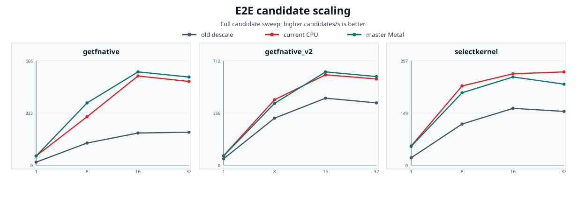

# Descale MVC Release Benchmark

## Executive Summary

This package compares the original descale CPU measurements, the existing current Release CPU measurements, and a fresh run using explicit `backend=metal` on the same source, VapourSynth runtime, decoder, geometry, and thread configurations. The explicit backend selects master’s heterogeneous Metal scheduler; it does not promise that every frame is executed on the GPU.

| Workload | Result |
|---|---:|
| E2E `getfnative` at R32T32 | 533.659 current CPU / 561.758 master Metal candidates/s |
| Fixed kernel coverage | 10 kernels x 4 thread configurations x 3 series; 4,000 frames per run |
| BlankClip kernel coverage | 10 kernels x 4 thread configurations x 3 series; 8,000 frames per run |
| Error coverage | Condition-aware CPU: 34,101 candidates; explicit Metal route audit: 34,101 requests, 0 actual Metal candidates |
| Master Metal coverage | 12 E2E cells + 40 fixed-kernel cells + 40 BlankClip cells |

At R1T1, current CPU and master Metal are both close to 3x the frozen old `getfnative` throughput: `19.686 -> 59.061 -> 58.692` candidates/s. At R32T32, master Metal reaches `561.758` candidates/s versus `533.659` current CPU and `210.479` frozen old CPU. The E2E master run completed all three candidate graphs, including arbitrary candidate heights used by the full scan.

This refresh reran only the error sweep, per-algorithm minima, and explicit Metal route audit after adding the condition-aware Float64 fallback. All throughput tables and charts remain unchanged from the existing run.

## Test System and Run Configuration

| Item | Configuration |
|---|---|
| CPU | `Apple M4 Max (16C/16T)` |
| OS | `Darwin 27.0.0 arm64`, ` ` |
| Memory | `128.0 GiB` physical memory at report generation |
| VapourSynth | `Core R78; API R4.2; API R3.6` |
| Input | 1920x1080; 1080p HEVC-10bit MKV |
| Source filter | `ffms2` |
| Source decoder options | decoder `default`, prefer_hw `0`, RAP verification `-1` |
| Thread sweep | `R1T1`, `R8T8`, `R16T16`, `R32T32`; each cell uses `core.num_threads=N` and `--requests N` |
| CPU error sweep | R32T32 recipe, `4` worker processes, `1` worker thread per process; `backend=cpu` |
| Metal error route audit | Same recipes and worker shape; `backend=metal`, one `get_frame(0)` per candidate, route markers recorded |

The reference scripts are the three supplied `.vpy` files. They use `core.lsmas.LWLibavSource` and `muf.getnative`; the release benchmark expands the same descale/reconstruction/statistics graph so old, current CPU, and master Metal namespaces can be selected independently. The output is statistics, not an encoded video stream.

## E2E Case Definitions

The measured graph starts with `source -> ShufflePlanes(plane=0, GRAY) -> resize.Point(format=GRAYS)`. The old implementation calls `core.descale`; the current CPU implementation calls `core.dsmvc` with `backend=cpu`; and the master implementation calls `core.dsmvc` with `backend=metal`, explicitly selecting the Metal scheduler. Each candidate then uses the matching reconstruction kernel, `std.Expr`, a 5-pixel border crop, and `PlaneStats`.

| Case | Scenario | Reference call shape | Measured candidate space |
|---|---|---|---|
| `getfnative` | Full non-vertical GetNative candidate scan | `muf.getnative(src, rescaler, src_heights=arange(700, 980, 0.1), base_height=1000)` | frame 12493; 11 scalers x 2,800 heights = 30,800 candidates |
| `getfnative_v2` | Vertical-only GetNative candidate scan | `muf.getnative(src, rescaler, src_heights=arange(840, 880, 0.1), base_height=1000, vertical_only=True)` | frame 358; 8 scalers x 400 heights = 3,200 candidates |
| `selectkernel` | Kernel-parameter selection at a fixed height | `muf.getnative(src, src_heights=719.8, base_height=1000, ex_thr=0.012, rescalers=...)` | frame 1111; bilinear + 10x10 Bicubic b/c grid = 101 candidates |

`getfnative` is the broad normal search: it scans both height and scaler family on a non-vertical geometry. `getfnative_v2` is the narrower vertical-only search. `selectkernel` holds height at 719.8 and scans kernel parameters, so it isolates kernel-selection cost from height search.

## Build and Provenance

- Source filter: `ffms2`
- Build: native Apple `arm64` Release; NEON/FMA is isolated to `cpu_executor_neon.cpp`
- Optimization: generic `-O3 -flto=full`; no model-specific `-mcpu`, PGO, or fast-math flags
- Link: Full LTO with the API4-only `VapourSynthPluginInit2` export
- Metal mode: explicit `backend=metal` heterogeneous scheduler; `backend=auto` was not used for any reported value
- Base code revision: `fbaaff5e70d5102ae262d57121a4aab7ad9ec1b9`; error-only candidate includes the condition-aware Float64 working-tree implementation
- Error-sweep and route-audit plugin SHA-256: `fb46dcd35e82d17d372823e505a9d972ceae5389d581a243c59fb0a884db925f`
- Precision policy: plans with estimated normal-matrix `rcond < 1e-4` retain Float64 transpose/factors, bypass Float32 packing and Metal execution, and keep Double intermediate storage until final Float32 conversion
- Original descale SHA-256: `af1e06298066721a2b0ec8705ca95f75608cf11041bb66eafb988ca79e2f9617`
- Corrected error runner SHA-256: `920e6a7f83c7ad110e45605d2b41272703e30616daf19ffc82c559ec0573937b`

## E2E Thread Scaling

The chart and table report candidates per second for the complete candidate graph. They include planner/cache work, FrameEval, reconstruction, Expr, PlaneStats, frame delivery, and VSPipe process overhead. Each cell is `old CPU -> current CPU -> master Metal scheduler (current/old / master/old)`; both multipliers use the frozen old CPU value as the denominator. The master value includes whatever CPU fallback the heterogeneous scheduler selected alongside Metal work.

| Case | R1T1 | R8T8 | R16T16 | R32T32 |
|---|---:|---:|---:|---:|
| `getfnative` | 19.686 -> 59.061 -> 58.692 (3.00x / 2.98x) | 141.459 -> 308.979 -> 396.913 (2.18x / 2.81x) | 205.361 -> 568.496 -> 594.557 (2.77x / 2.90x) | 210.479 -> 533.659 -> 561.758 (2.54x / 2.67x) |
| `getfnative_v2` | 44.420 -> 64.785 -> 63.847 (1.46x / 1.44x) | 320.716 -> 446.127 -> 421.386 (1.39x / 1.31x) | 456.624 -> 615.808 -> 635.644 (1.35x / 1.39x) | 424.790 -> 587.598 -> 603.824 (1.38x / 1.42x) |
| `selectkernel` | 21.240 -> 54.728 -> 53.694 (2.58x / 2.53x) | 117.257 -> 225.672 -> 206.224 (1.92x / 1.76x) | 161.850 -> 260.210 -> 251.146 (1.61x / 1.55x) | 153.153 -> 265.550 -> 230.634 (1.73x / 1.51x) |

## E2E Error Comparison

The CPU error sweep evaluates every candidate in each recipe on the same training frame. Old descale was rerun only for this permitted error comparison and the consolidated minima below. Metrics use the benchmark's 5-pixel border crop. The maximum columns are pairwise old-versus-condition-aware output differences; they are not errors against a mathematical reference. A larger value can therefore mean that the new solver corrected an unstable old result.

### CPU Error Sweep

| Case | Candidates | Best old | Best condition-aware CPU | Changed old -> condition-aware CPU | Max old/new output abs | Max old/new reconstruction abs |
|---|---:|---|---|---|---:|---:|
| `getfnative` | 30,800 | bilinear@979.2 (0.00053924) | bilinear@979.2 (0.00053924) | False | 0.0553046 | 8.28505e-06 |
| `getfnative_v2` | 3,200 | bicubic_b1.0_c0.0@876.7 (0.000476052) | bicubic_b1.0_c0.0@876.7 (0.000476052) | False | 1.37091e-06 | 2.38419e-07 |
| `selectkernel` | 101 | bicubic_b0.0_c0.0@719.8 (0.00122794) | bicubic_b0.0_c0.0@719.8 (0.00122793) | False | 1.43051e-06 | 4.76837e-07 |

The condition-aware CPU keeps the same best candidate as old descale in all three cases. The small MAE difference in `selectkernel` does not change the selected candidate.

### Candidate Geometry and Conditioning Correction

The previous error runner mirrored the supplied scripts' `muf.arange`, which generates values by repeated binary floating-point addition; upstream muvsfunc commit `d278cd3a68250a4d9562c6ec2b401f1a76c324a3` still implements it as `current += step`. The candidate displayed as `lanczos2@978.0` was therefore actually `978.0000000000632`, which crossed an `int()` boundary and produced `1740x980, src_top=0.9999999999683951` instead of the nominal `1740x978, src_top=0`. For the corrected release error comparison, the runner intentionally normalizes both one-decimal height grids to integer tenths. In `getfnative`, this removes the unintended `+2` output height from 139 of the 2,800 unique height values.

After geometry correction, `lanczos2@978.0` remains on the Float32 fast path and has `5.96046e-7` maximum old/new output difference and `4.76837e-7` maximum reconstruction difference. The adjacent `lanczos2@978.1` vertical plan has `rcond=3.94802e-6` and enters Float64. Its old/new output maximum is now `0.00318551`, output MAE is `1.12696e-6`, and reconstruction maximum is `3.87430e-6`. The axis-level correctness gate places the Float64 result about `2.97e-6` from a direct Float64 Householder QR reference, versus about `2.51e-4` for the retained Float32-factor path.

The full-sweep old/new output maximum moves to `bilinear@974.3` at `0.0553046`; its reconstruction difference is only `2.98023e-6`. This candidate's horizontal plan has `rcond=2.26783e-6` and a `322,349.67` maximum inverse diagonal. At the exact maximum-difference output point, an independent 60-digit solve of the same separable operator gives `-0.599072119`; old descale gives `-0.543762505` (`0.0553096` absolute error), while the condition-aware result gives `-0.599067152` (`4.96776e-6` absolute error). The new result is about 11,100x closer to the high-precision reference at that point.

The larger pairwise sweep maximum therefore exposes the old Float32 normal-equation error; it is not a larger error in the new solver. Ill-conditioning permits a large change in the inferred native image while the forward reconstruction changes by only a few micro-units. The global `getfnative` reconstruction maximum is `8.28505e-6` at `bilinear@979.9`, and all selected candidates remain unchanged.

Only the error sweep, minima, and Metal route audit were rerun with normalized geometry and the condition-aware candidate. The frozen throughput values above predate this correction, retain the earlier script-faithful accumulated heights, and are not condition-aware timing evidence.

### Metal Error Route Audit

The corrected full sweep was also rerun with the same condition-aware plugin and `backend=metal`, but its worker requests one frame at a time. The route audit reads `_DSMVCMetal` and `_DSMVCMetalBatch` from each new frame. All 34,101 requests returned `_DSMVCMetal=0` and `_DSMVCMetalBatch=0` and were handled by the scheduler's CPU path; ill-conditioned plans are additionally required to stay in that CPU lane. There is therefore no actual Metal error sample to publish. For each of the three cases, the normalized per-candidate row payload was hash-identical to the CPU sweep. The identical values seen in a three-way table would be the CPU result labeled by the requested backend, not an independent Metal measurement.

| Case | Candidates requested | Actual Metal route | CPU fallback | Best master Metal | Metal error result |
|---|---:|---:|---:|---|---|
| `getfnative` | 30,800 | 0 | 30,800 | n/a | no Metal sample |
| `getfnative_v2` | 3,200 | 0 | 3,200 | n/a | no Metal sample |
| `selectkernel` | 101 | 0 | 101 | n/a | no Metal sample |

### Consolidated CPU Per-Algorithm Minima

Each row groups all parameter variants of one algorithm family and keeps the best old/condition-aware CPU candidate within that family. `CPU Delta MAE` is `condition-aware CPU - old`; a negative value is an improvement. No Metal minima are reported because the full Metal route audit produced zero Metal-routed candidates.

| Case | Algorithm family | Candidates | Old best (candidate; height / MAE) | Condition-aware CPU best (candidate; height / MAE) | CPU Delta MAE | Height changed |
|---|---|---:|---|---|---:|---|
| `getfnative` | `bicubic` | 14,000 | `bicubic_b0.0_c0.5@979.3`; 979.3 / 0.000544565 | `bicubic_b0.0_c0.5@979.3`; 979.3 / 0.000544565 | -2.87258e-11 | False |
| `getfnative` | `bilinear` | 2,800 | `bilinear@979.2`; 979.2 / 0.00053924 | `bilinear@979.2`; 979.2 / 0.00053924 | +0 | False |
| `getfnative` | `lanczos2` | 2,800 | `lanczos2@979.2`; 979.2 / 0.00054352 | `lanczos2@979.2`; 979.2 / 0.00054352 | +2.62358e-11 | False |
| `getfnative` | `lanczos3` | 2,800 | `lanczos3@979.2`; 979.2 / 0.000584545 | `lanczos3@979.2`; 979.2 / 0.000584545 | +5.50181e-11 | False |
| `getfnative` | `lanczos4` | 2,800 | `lanczos4@979.3`; 979.3 / 0.000617304 | `lanczos4@979.3`; 979.3 / 0.000617304 | +1.42016e-11 | False |
| `getfnative` | `spline16` | 2,800 | `spline16@979.2`; 979.2 / 0.000559219 | `spline16@979.2`; 979.2 / 0.000559219 | +3.16769e-11 | False |
| `getfnative` | `spline36` | 2,800 | `spline36@979.2`; 979.2 / 0.000579655 | `spline36@979.2`; 979.2 / 0.000579655 | +6.74533e-11 | False |
| `getfnative_v2` | `bicubic` | 2,000 | `bicubic_b1.0_c0.0@876.7`; 876.7 / 0.000476052 | `bicubic_b1.0_c0.0@876.7`; 876.7 / 0.000476052 | +3.70094e-12 | False |
| `getfnative_v2` | `bilinear` | 400 | `bilinear@877.5`; 877.5 / 0.000483636 | `bilinear@877.5`; 877.5 / 0.000483636 | +0 | False |
| `getfnative_v2` | `spline16` | 400 | `spline16@877.4`; 877.4 / 0.000477543 | `spline16@877.4`; 877.4 / 0.000477543 | -5.75546e-12 | False |
| `getfnative_v2` | `spline36` | 400 | `spline36@876.8`; 876.8 / 0.000476866 | `spline36@876.8`; 876.8 / 0.000476866 | +2.58501e-12 | False |
| `selectkernel` | `bicubic` | 100 | `bicubic_b0.0_c0.0@719.8`; 719.8 / 0.00122794 | `bicubic_b0.0_c0.0@719.8`; 719.8 / 0.00122793 | -5.87782e-09 | False |
| `selectkernel` | `bilinear` | 1 | `bilinear@719.8`; 719.8 / 0.00123996 | `bilinear@719.8`; 719.8 / 0.00123996 | +0 | False |

## Fixed Kernel Throughput

Each cell is `old CPU -> current CPU -> master Metal scheduler (current/old / master/old)` FPS for the first 4,000 frames at the common fixed `1920x1080 -> 1440x810` geometry. Old and current CPU values are retained; all explicit scheduler kernel runs completed in this run. Completion does not imply that every measured frame was GPU-assigned.

[Open the full fixed-kernel scaling chart](../release-benchmark-arm64-svg/fixed-kernel-scaling.svg)

| Kernel | R1T1 | R8T8 | R16T16 | R32T32 |
|---|---:|---:|---:|---:|
| `bilinear` | 158.496 -> 947.028 -> 858.925 (5.98x / 5.42x) | 866.063 -> 1140.685 -> 1123.629 (1.32x / 1.30x) | 796.648 -> 1060.701 -> 1108.116 (1.33x / 1.39x) | 826.897 -> 1057.905 -> 1083.771 (1.28x / 1.31x) |
| `bicubic (0, 0.5)` | 62.520 -> 882.565 -> 830.397 (14.12x / 13.28x) | 440.183 -> 1067.915 -> 1120.724 (2.43x / 2.55x) | 513.271 -> 1044.782 -> 1100.821 (2.04x / 2.14x) | 522.842 -> 1026.556 -> 1080.665 (1.96x / 2.07x) |
| `lanczos2` | 63.393 -> 881.387 -> 829.476 (13.90x / 13.08x) | 434.147 -> 1054.629 -> 1115.550 (2.43x / 2.57x) | 518.879 -> 1045.797 -> 1094.929 (2.02x / 2.11x) | 535.333 -> 1020.412 -> 1078.899 (1.91x / 2.02x) |
| `lanczos3` | 47.340 -> 615.449 -> 509.243 (13.00x / 10.76x) | 310.286 -> 880.198 -> 881.826 (2.84x / 2.84x) | 381.292 -> 871.849 -> 986.825 (2.29x / 2.59x) | 392.117 -> 859.474 -> 989.535 (2.19x / 2.52x) |
| `lanczos4` | 39.036 -> 558.707 -> 463.395 (14.31x / 11.87x) | 260.827 -> 804.999 -> 821.875 (3.09x / 3.15x) | 325.738 -> 799.135 -> 927.860 (2.45x / 2.85x) | 330.851 -> 790.601 -> 949.705 (2.39x / 2.87x) |
| `lanczos5` | 31.400 -> 394.662 -> 339.230 (12.57x / 10.80x) | 217.551 -> 672.025 -> 720.584 (3.09x / 3.31x) | 275.435 -> 675.925 -> 814.438 (2.45x / 2.96x) | 284.424 -> 666.734 -> 865.343 (2.34x / 3.04x) |
| `lanczos6` | 33.638 -> 345.941 -> 300.301 (10.28x / 8.93x) | 231.585 -> 612.208 -> 658.372 (2.64x / 2.84x) | 280.403 -> 619.556 -> 731.380 (2.21x / 2.61x) | 280.636 -> 612.802 -> 819.376 (2.18x / 2.92x) |
| `spline16` | 64.375 -> 925.146 -> 825.049 (14.37x / 12.82x) | 456.179 -> 1062.145 -> 1085.810 (2.33x / 2.38x) | 546.771 -> 1049.927 -> 1077.246 (1.92x / 1.97x) | 540.066 -> 1012.653 -> 1052.939 (1.88x / 1.95x) |
| `spline36` | 47.163 -> 638.425 -> 509.548 (13.54x / 10.80x) | 317.770 -> 872.284 -> 876.475 (2.75x / 2.76x) | 389.112 -> 858.444 -> 970.023 (2.21x / 2.49x) | 402.177 -> 856.668 -> 958.643 (2.13x / 2.38x) |
| `spline64` | 39.025 -> 564.513 -> 461.992 (14.47x / 11.84x) | 259.705 -> 807.315 -> 818.099 (3.11x / 3.15x) | 331.288 -> 805.607 -> 919.630 (2.43x / 2.78x) | 338.321 -> 793.924 -> 930.506 (2.35x / 2.75x) |

## Master Metal Coverage

The master Metal throughput run used the common 810p fixed geometry and explicit `backend=metal` for every reported throughput cell. Here, “master Metal” means the explicit Metal scheduler path, including scheduler-selected CPU fallback; it is not a pure-GPU frame count. The separate error route audit used the full arbitrary candidate geometries and produced no Metal-routed candidates. The integration suite `tests/vs_metal_integration.py` and the Metal E2E smoke check passed before the full runs. This section replaces the older 1692x952 supplement; no values from that different geometry are included.

| Graph | Cells | Frames per cell | Backend |
|---|---:|---:|---|
| E2E candidate scans | 12 | full candidate count | explicit `backend=metal` scheduler |
| Fixed kernel | 40 | 4,000 + 256 warmup | explicit `backend=metal` scheduler |
| BlankClip fixed kernel | 40 | 8,000 + 256 warmup | explicit `backend=metal` scheduler |
| Error route audit | 3 recipes / 34,101 requests; 0 Metal-routed | one training frame per candidate | `backend=metal` requested; CPU fallback observed |

[Open the master Metal kernel comparison chart](../release-benchmark-arm64-svg/metal-scaling.svg)

`backend=metal` selects the explicit Metal scheduler; it is not an alias for `backend=auto`. The scheduler is heterogeneous: its normal CPU quota, incomplete batches, queue pressure, or other admission conditions can invoke the CPU callback for some frames, while explicit Metal failures are surfaced rather than silently converting the whole request to `auto`. The `_DSMVCMetal` and `_DSMVCMetalBatch` frame properties identify actual Metal-assigned work; these throughput tables do not claim that Metal-assigned frames equal total frames. `backend=auto` was not used: it is a separate admission route whose clip length, core-thread, concurrency, and work thresholds can keep a request on CPU before any Metal submission. These results establish coverage for the benchmark graphs above, not universal support for every possible VapourSynth geometry or format.

## BlankClip Throughput

Each cell is `old CPU -> current CPU -> master Metal scheduler (current/old / master/old)` FPS for 8,000 frames from an in-memory 1920x1080 GRAYS `std.BlankClip` at fixed 810p geometry. There is no decoder, source filter, or input-video content; this isolates the fixed-kernel execution path and VapourSynth frame plumbing while retaining the scheduler’s mixed CPU/Metal behavior.

[Open the blank fixed-kernel scaling chart](../release-benchmark-arm64-svg/blank-fixed-kernel-scaling.svg)

| Kernel | R1T1 | R8T8 | R16T16 | R32T32 |
|---|---:|---:|---:|---:|
| `bilinear` | 166.448 -> 1692.041 -> 1247.548 (10.17x / 7.50x) | 1256.098 -> 4061.567 -> 2474.862 (3.23x / 1.97x) | 1855.165 -> 4906.865 -> 3223.053 (2.64x / 1.74x) | 1862.772 -> 4679.891 -> 2927.750 (2.51x / 1.57x) |
| `bicubic (0, 0.5)` | 73.912 -> 1548.881 -> 1170.813 (20.96x / 15.84x) | 506.981 -> 3776.725 -> 2366.300 (7.45x / 4.67x) | 815.629 -> 4427.108 -> 3137.578 (5.43x / 3.85x) | 813.587 -> 4336.725 -> 2958.423 (5.33x / 3.64x) |
| `lanczos2` | 69.261 -> 1547.786 -> 1167.374 (22.35x / 16.85x) | 473.797 -> 3791.031 -> 2384.730 (8.00x / 5.03x) | 843.436 -> 4502.870 -> 3042.189 (5.34x / 3.61x) | 829.630 -> 4320.013 -> 2910.234 (5.21x / 3.51x) |
| `lanczos3` | 46.542 -> 806.238 -> 585.817 (17.32x / 12.59x) | 339.724 -> 2079.572 -> 1220.666 (6.12x / 3.59x) | 542.648 -> 2518.573 -> 1701.043 (4.64x / 3.13x) | 542.877 -> 2434.639 -> 1631.916 (4.48x / 3.01x) |
| `lanczos4` | 38.702 -> 693.918 -> 525.519 (17.93x / 13.58x) | 282.410 -> 1733.685 -> 1074.595 (6.14x / 3.81x) | 441.595 -> 2045.656 -> 1628.711 (4.63x / 3.69x) | 433.803 -> 1989.242 -> 1590.805 (4.59x / 3.67x) |
| `lanczos5` | 30.282 -> 368.241 -> 314.393 (12.16x / 10.38x) | 232.607 -> 1020.923 -> 881.879 (4.39x / 3.79x) | 354.159 -> 1281.322 -> 1277.621 (3.62x / 3.61x) | 352.566 -> 1247.843 -> 1448.190 (3.54x / 4.11x) |
| `lanczos6` | 30.671 -> 312.069 -> 270.653 (10.17x / 8.82x) | 234.797 -> 829.711 -> 765.862 (3.53x / 3.26x) | 341.343 -> 1043.690 -> 1080.688 (3.06x / 3.17x) | 344.123 -> 1023.540 -> 1297.708 (2.97x / 3.77x) |
| `spline16` | 66.678 -> 1555.754 -> 1170.314 (23.33x / 17.55x) | 544.752 -> 3758.925 -> 2394.178 (6.90x / 4.39x) | 767.984 -> 4420.011 -> 2874.961 (5.76x / 3.74x) | 836.479 -> 4379.312 -> 2850.995 (5.24x / 3.41x) |
| `spline36` | 46.716 -> 806.716 -> 586.906 (17.27x / 12.56x) | 359.990 -> 1993.822 -> 1215.677 (5.54x / 3.38x) | 539.218 -> 2434.678 -> 1611.088 (4.52x / 2.99x) | 542.075 -> 2420.351 -> 1685.581 (4.46x / 3.11x) |
| `spline64` | 38.285 -> 696.280 -> 526.348 (18.19x / 13.75x) | 293.693 -> 1677.540 -> 1075.005 (5.71x / 3.66x) | 432.330 -> 2002.193 -> 1561.899 (4.63x / 3.61x) | 438.089 -> 1957.288 -> 1526.759 (4.47x / 3.49x) |

## Interpretation

The condition-aware CPU error sweep preserves the same candidate choices and per-family minima as old descale across all three E2E recipes. It removes the invalid `lanczos2@978.0` geometry spike and routes valid ill-conditioned plans to a Float64 solve. The resulting larger old/new output maximum is expected: direct high-precision checks show that the new bilinear and Lanczos results are much closer to the intended least-squares solution, while old Float32 factor error is amplified by the inverse problem. The Metal error route audit does not establish Metal numerical parity: every one of its 34,101 requests took the CPU fallback path. Throughput remains workload-dependent: the frozen master scheduler run improves on current CPU for the broad `getfnative` scan at R8T8-R32T32, while the narrower `getfnative_v2` and `selectkernel` cases vary by thread count.

The fixed-kernel tables isolate executor and frame-plumbing cost. They show that master Metal is not uniformly faster at R1T1, but it exceeds current CPU for many wider Lanczos and Spline cases at higher request counts. BlankClip removes decoder cost and exposes the same algorithm-dependent tradeoff. These measurements are benchmark-specific evidence, not a claim of universal Metal speedup.

## Retained Artifacts

This release snapshot retains the benchmark report and four SVG charts only. Per-cell JSON and CSV files, error shards, command logs, and generated subreports are intentionally omitted from Git.
